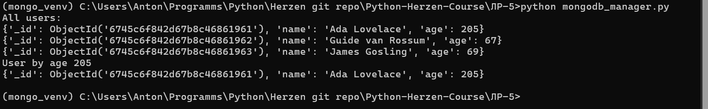

### Лабораторная работа № 5. Задачи. Генераторы. Менеджеры контекста.
## Комплект 1: Итераторы. Генераторы.
Задача 1.1
Создайте свой класс-итератор class RandomNumberIterator, который, в ходе итерирования по такому итератору, генерирует случайные числа в количестве и в диапазоне, которые передаются в конструктор в виде списка параметров.

random_interato_class.py
```python
import random

class RandomNumberGenerator(object):
    def __init__(self: object, lst: list) -> None:
        """
        Constructor.

        Args:
            lst: List with parameters, where:
                lst[0] - quantity of random numbers to generate
                lst[1] - min value of random numbers
                lst[2] - max value of random numbers

        Raises:
            ValueError: If quantity is less than 0.
        """
        self.index = 0
        # count, min, max = lst[0], lst[1], lst[2]
        self.count, self.min, self.max = lst
        
        if self.count <= 0:
            raise ValueError("Quantity must be greater than 0")
        if self.max <= self.min:
            raise ValueError("Max must be greater than min")
    
    def __iter__(self):
        return self
    
    def __next__(self):
        """
        Generate next random number.

        Returns:
            int: Random number.

        Raises:
            StopIteration: If all numbers were generated.
        """
        if self.index < self.count:
            self.index += 1
            return random.randint(self.min, self.max)
        else:
            raise StopIteration

def main():
    class_gen = RandomNumberGenerator([5, 0, 3])

    print("RandomNumberGenerator class")
    for num in class_gen:
        print(num)

if __name__ == "__main__":
    main()

```
Результат работы программы:
```python
RandomNumberGenerator class
2
3
3
3
2
```

Анализ:
Метод __iter__ позволяет использовать объект класса как генератор, а метод __next__ генерирует следующее случайное число до тех пор, пока не будет достигнут лимит.
Функционал позволяет перебирать случайные числа с помощью цикла for. Когда все числа сгенерированы, выбрасывается исключение StopIteration.

Задача 1.2
Решите задачу 1.1 уже с использованием генераторной функции, использующей ключевое слово yield. В качестве аргументов она должна принимать количество элементов и диапазон.

random_interato_func.py
```python
import random

def random_numbers_generator(params: list) -> int:
    """
    Generate random numbers in range [min_val, max_val] quantity times.

    Args:
        params: List with parameters, where:
            params[0] - quantity of random numbers to generate
            params[1] - min value of random numbers
            params[2] - max value of random numbers

    Yields:
        int: Random number in range [min_val, max_val]

    Raises:
        ValueError: If quantity is less than or equal to 0.
        ValueError: If max is less than or equal to min.
    """
    quantity, min_val, max_val = params

    if quantity <= 0:
        raise ValueError("Quantity must be greater than 0")
    if max_val <= min_val:
        raise ValueError("Max must be greater than min")

    for i in range(quantity):
        yield random.randint(min_val, max_val)

def main():
    func_gen = random_numbers_generator([5, 0, 3])
    
    print("random_numbers_generator function")
    for num in func_gen:
        print(num)

if __name__ == "__main__":
    main()

```

Результат:
```python
random_numbers_generator function
3
1
2
3
0
```

Анализ:
Генерация чисел осуществляется с помощью конструкции yield. Использование yield позволяет экономно использовать память, так как числа генерируются по одному по мере необходимости.

Задание 1.3

Сделайте две функции-генератора. Первый генератор создаёт ряд Фибоначчи, а второй генератор добавляет значение 10 к каждому числу.
Вызовете эти генераторы так, чтобы сгенерировать некоторое количество чисел Фибоначчи с добавлением числа 10 к каждому числу.

fib_iter.py
```python
def fib_generator(n: int) -> int:
    """
    Generate the first n Fibonacci numbers.

    Args:
        n: The number of Fibonacci numbers to generate.

    Yields:
        int: The next Fibonacci number.
    """
    a, b = 0, 1

    for i in range(n):
        yield a
        a, b = b, a + b

def plus_ten(nums_iter: object) -> int:
    """
    Given an iterator of numbers, yield each number plus 10.

    Args:
        nums_iter: An iterator of numbers.

    Yields:
        int: The next number plus 10.
    """
    for num in nums_iter:
        yield num + 10

def main():
    n = 7
    fib_numbers = fib_generator(n)
    fib_plus_ten = plus_ten(fib_generator(n))

    print("Fibonacci generator")
    for num in fib_numbers:
        print(num)

    print("Fibonacci numbers plus 10")
    for num in fib_plus_ten:
        print(num)

if __name__ == "__main__":
    main()

```

Результат:
```python
Fibonacci generator
0
1
1
2
3
5
8
Fibonacci numbers plus 10
10
11
11
12
13
15
18
```

Анализ:
С использованием yield программа генерирует только те числа, которые необходимы, и не требует хранения всей последовательности в памяти, что выгодно для работы с большими значениями n.
Функция plus_ten служит для изменения значений, которые она получает от другой функции-генератора, демонстрируя использование композиции генераторов, когда один генератор передаёт данные другому для дальнейшей обработки.


Задача 1.4
Напишите программу, на вход к которой подается список стран и городов для каждой страны. Затем по названиям городов из ещё одного списка выводится в какой стране расположен каждый город.

country_city.py
```python
def find_country_by_city(country_city_dict: dict, city_list: list) -> tuple:
    """
    Iterate over all cities in city_list and for each city, find the country
    in country_city_dict. Yield tuples of city and country.

    :param country_city_dict: dict with countries as keys and lists of cities as values
    :param city_list: list of cities to search for
    :return: tuple of city, country
    """
    for city in city_list:
        for country, cities in country_city_dict.items():   # Iterate over countries
            if city in cities:
                yield city, country

country_city_dict = {                                       # Search dict
    'Russia': ['Moscow', 'Saint-Petersburg', 'Novgorod'],
    'China': ['Beijing', 'Shanghai', 'Nanjing'],
    'USA': ['New York', 'Los Angeles', 'Chicago'],
    'Italy': ['Rome', 'Milan', 'Turin'],
}

city_list = ['Milan', 'Rome', 'Paris', 'Saint-Petersburg', 'Chicago', 'Shanghai']

def main():
    for city, country in find_country_by_city(country_city_dict, city_list):
        print(f"City {city} is in {country}")

if __name__ == "__main__":
    main()

```

Результат:
```python
City Milan is in Italy
City Rome is in Italy
City Saint-Petersburg is in Russia
City Chicago is in USA
City Shanghai is in China
```

Анализ:
Функция find_country_by_city возвращает результат, как генератор, что экономит память при больших объёмах данных.
Если город из city_list не найден в словаре, он пропускается.
Сложность алгоритма 𝑂(𝑛×𝑚), где 𝑛 — количество городов, 𝑚 — количество стран, может быть медленной при увеличении данных.


## Комплект 2: Менеджеры контекста.
Задание 2.1

Напишите класс менеджера контекста Timer, который умеет считать время в секундах, затраченное на некоторые вычисления внутри соответствующего блока with с помощью функции perf_counter модуля time. Используйте этот менеджер контекста для определения времени на вычисления достаточно большого количества чисел Фибоначчи (например миллиона) в цикле с помощью отдельной функции генератора.

time_manager.py
```python
	import time

class Timer:
    def __enter__(self):
        self.start_time = time.perf_counter()
        return self
    
    def __exit__(self, exc_type, exc_val, exc_tb):
        self.end_time = time.perf_counter()
        self.execution_time = self.end_time - self.start_time       # time in seconds
        print(f"Execution time: {self.execution_time:.6f} seconds") # format to 6 decimal places

def fib_gen(n: int) -> int:
    """
    Generate the first n Fibonacci numbers.

    Args:
        n: The number of Fibonacci numbers to generate.

    Yields:
        int: The next Fibonacci number.
    """
    a, b = 0, 1

    for i in range(n):
        yield a
        a, b = b, a + b

def main():
    limit = 100000     # 100.000 fibonacci numbers

    with Timer() as t:
        fib_numbers = list(fib_gen(limit))

    print(f"{fib_numbers[:10]}...")

if __name__ == "__main__":
    main()
    
```

Результат:
```python
Execution time: 0.363254 seconds
[0, 1, 1, 2, 3, 5, 8, 13, 21, 34]...
```

Анализ:
Программа измеряет время выполнения с использованием пользовательского контекстного менеджера Timer. Результат включает первые 10 чисел Фибоначчи и общее время выполнения.
Класс Timer использует методы __enter__ и __exit__ для автоматического измерения времени выполнения блока кода.


Задание 2.2
Напишите класс менеджера контекста BatchCalculatorContextManager, для вашего проекта калькулятора из предыдущих лабораторных работ. Этот менеджер контекста должен уметь открывать и закрывать текстовый файл, в каждой строчке которого записана пара чисел в сочетании с арифметической операцией над ними в виде простого арифметического выражения без пробелов. В сочетании с дополнительной функцией генератором и вашим менеджером контекста прочитайте все строчки текстового файла и вызовите нужное число раз функцию calculate(...) вашего калькулятора, чтобы распечатать все результаты на экране.

BatchCalculatorContextManager.py
```python
	from time import perf_counter
from calc.calculator_with_tolerance import calculate

class BatchCalculatorContextManager(object):
    def __init__(self, file_name):
        """
        Initializes the BatchCalculatorContextManager with the given file name.

        :param file_name: The name of the file to be opened and processed.
        """
        self.filename = file_name
    
    def __enter__(self):
        """
        Entering the context manager. Setting up timer and opening the file.

        :return: The opened file.
        """
        self.start_time = perf_counter()
        self.read_file = open(self.filename, 'r')

        return self.read_file

    def __exit__(self, exc_type, exc_value, traceback):
        """
        Exiting the context manager. Closes the file and prints the execution time.

        :param exc_type: The type of exception.
        :param exc_value: The value of exception.
        :param traceback: The traceback of exception.
        """
        self.read_file.close()

        self.end_time = perf_counter()
        self.execution_time = self.end_time - self.start_time
        print(f"Execution time: {self.execution_time:.6f} seconds")

def generate_input_from_log(iterable: list) -> str:
    """
    Iterates over a list of strings, processes each string, and yields
    a formatted prompt if valid.

    Each item in the iterable is expected to be a string that contains
    a prompt separated by colons and commas. The function extracts the
    last segment after the last colon, splits it by commas, and checks
    if the resulting list has at least three elements. If so, the list
    is joined with spaces and yielded.

    :param iterable: A list of strings to be processed.
    :yield: A string containing a space-joined prompt if valid.
    """
    for item in iterable:
        # 'INFO"__main__:+,1,2,3,0.001' -> ['+', '1', '2', '3', '0.001']
        calculation_info = item.strip('\n').split(':')[-1]
        prompt = calculation_info.split('=')[0].split(',')

        if len(prompt) >= 3:                    # check if prompt is valid
            yield ' '.join(prompt)

def calc_with_manager(filename: str) -> None:
    """
    Reads a file with managed context, and prints the result of
    calculation or an error message if an exception occurs.

    :param filename: The name of the file to be read.
    """
    
    with BatchCalculatorContextManager(filename) as file:
        for expression in generate_input_from_log(file):
            try:
                result = calculate(expression)
                print(f"Task: {expression}")
                print(f"Result: {result}", end='\n\n')

            except Exception as e:
                print(f"Error: {e}")

if __name__ == "__main__":
    calc_with_manager('calc_log.log')

```

Результат:
```python
Task: + 5 4 3 1.0
Result: 12

Task: - 8 3 1.0
Result: 5

Task: * 4 9 1.0
Result: 36

Task: / 64 7 0.001
Result: 9.143

Task: ^ 4 7 1.0
Result: 16384

Task: % 48 3 1.0
Result: 0

Task: mean 1 8 6 7 5 3 15 14 10 1e-05
Result: 7.66667

Task: var 8 6 2 7 13 10 9 7 15 12 1e-06
Result: 14.322222

Execution time: 0.005845 seconds
```

Анализ:
Контекстный менеджер BatchCalculatorContextManager упрощает управление файлами, автоматически открывая и закрывая их. Также он измеряет и выводит время выполнения блока кода внутри своего контекста.


Задание 2.3
Установите локально на свой компьютер объектную базу данных MongoDB.
Установите с помощью менеджера пакетов pip или conda, в зависимости от того чем вы пользуетесь, пакет pymongo для подключения к базам данных MongoDB. Например команда для pip: pip install pymongo. С помощью инструмента MongoDB Shell создайте нового пользователя с правами админа, к примеру. Введите в командной строке mongosh без аргументов и уже в командной строке внутри MongoDB Shell введите:
db.createUser({
	user: "myUserAdmin",
	pwd: "abc123",
	roles: [
	{ role: "userAdminAnyDatabase", db: "admin" },
	"readWriteAnyDatabase"
	]
})
Затем выйдите из MongoDB Shell (Введите exit или нажмите Ctrl-D). Перезайдите снова в MongoDB Shell с помощью команды mongosh -u myUserAdmin в командной строке и введя пароль abc123. Тем самым вы залогинетесь в базу MongoDB под новой учётной записью.
Создайте пустую базу данных myshinynewdb с помощью команды use myshinynewdb. Добавьте коллекцию user в эту базу данных с одной единственной записью: db.user.insert({name: "Ada Lovelace", age: 205}). Коллекция будет создана автоматически. Напишите класс менеджера контекста для управляемого подключения к MondoDB и отключения от неё. Внутри блока with с помощью вызова метод user_collection.find({'age': 205}) найдите вашу запись о "Ada Lovelace" и распечатайте её в терминале.

mongodb_manager.py
```python
from pymongo import MongoClient

class MongoDBConnectManager(object):
    def __init__(self, host="mongodb://localhost", port=27017, username="admin", password="admin"):
        """
        Create a new instance of the MongoDBConnectManager class.

        :param host: The url of the MongoDB server
        :param username: The username to use for authentication
        :param password: The password to use for authentication
        :return: a MongoDBConnectManager instance
        """
        self.host = host
        self.port = port
        self.username = username
        self.password = password
        self.connection = None

    def __enter__(self):
        """
        Start a new connection to the MongoDB server.

        :return: the MongoDBConnectManager instance
        """
        self.connection = MongoClient(
            self.host, self.port,
            username=self.username, password=self.password,
            authMechanism="SCRAM-SHA-1"
            )
        
        return self

    def __exit__(self, exc_type, exc_value, traceback):
        self.connection.close()


def main():
    mongo = MongoDBConnectManager(host="mongodb://localhost", port=27017, username="AntSibAdmin", password="AntSibDBPassword")

    with mongo:
        users = mongo.connection['mynewdb']['user']

        print(f"All users:")
        found_users = users.find()

        for user in found_users:
            print(user)
        
        print(f"User by age 205")
        found_users = users.find({'age': 205})

        for user in found_users:
            print(user)


if __name__ == "__main__":
    main()

```

Результат:


Анализ:
Контекстный менеджер MongoDBConnectManager управляет подключением к MongoDB, автоматически открывая соединение при входе и закрывая при выходе из контекста.

