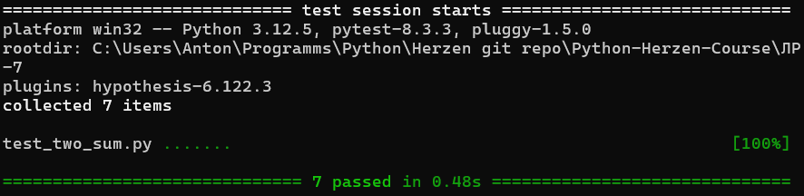
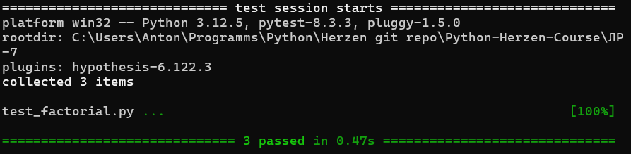

# Лабораторная работа 7. Параметризация
### Задача 1. Проверка с помощью создания контекста функций по считыванию настроек калькулятора и записи в файл результатов выполнения операций

Тестирование с помощью unittest
test_calc_read_write_unittest.py
```python

    # Проверка с помощью создания контекста функций по считыванию настроек
    # калькулятора и запись в файл результатов выполнения операций

    # Используя параметризация тестов написать тесты функции two_sum

    # Используя гипотезы с помощью hypothesis протестировать вычисление факториала

import unittest
from calc import calculator_with_tolerance
import os
import tempfile


class TestCalcReadWrite(unittest.TestCase):
    @classmethod
    def setUpClass(self):
        """
        SetupClass creates 3 temporary files used for testing. One contains
        valid configuration parameters, one contains invalid configuration
        parameters, and one is empty to test writing to the output file.
        """
        with tempfile.NamedTemporaryFile(delete=False, mode='w') as temp_config_file:
            temp_config_file.write("tolerance = 0.000001\noutput = output.log\n")
        self.config_file = temp_config_file

        with tempfile.NamedTemporaryFile(delete=False, mode='w') as temp_incorrect_config_file:
            temp_incorrect_config_file.write("dance = abc\nblah = 15\n")
        self.incorrect_config_file = temp_incorrect_config_file

        with tempfile.NamedTemporaryFile(delete=False, mode='w') as temp_output_file:
            temp_output_file.write("")
        self.output_file = temp_output_file

    def test_calc_load_params_valid(self):
        """
        Test that the load_params function correctly loads valid parameters
        from a configuration file.
        """
        params = calculator_with_tolerance.load_params(self.config_file.name)
        self.assertEqual(params, {'tolerance': 1e-6, 'output': 'output.log'})

    def test_calc_load_params_invalid(self):
        """
        Test that the load_params function correctly uses default parameters when
        the given configuration file does not exist.
        """
        params = calculator_with_tolerance.load_params('invalid_file')
        self.assertEqual(params, {'tolerance': 1e-6, 'output': 'default_calc.log'})

    def test_calc_load_params_corrupted(self):
        """
        Test that the load_params function correctly uses default parameters when
        the given configuration file contains invalid parameters.
        """
        params = calculator_with_tolerance.load_params(self.incorrect_config_file.name)
        self.assertEqual(params, {'tolerance': 1e-6, 'output': 'default_calc.log'})
        
    def test_calc_write_result(self):
        """
        Test that the calculate function writes the correct result to the output file.
        """
        with open(self.output_file.name, 'r') as file:
            logger = calculator_with_tolerance.setup_logger(self.output_file.name)
            calculator_with_tolerance.calculate("+ 1 2 3 4 1")
            logger_output = file.readlines()[-1].split(':')[-1]
            self.assertIn("+,1,2,3,4,1.0=10\n", logger_output)
            

    @classmethod
    def tearDownClass(self):
        """
        Remove temporary files created by setUpClass and delete the references
        to them. This is necessary to avoid leaving temporary files on the
        filesystem after the tests have finished running.
        """
        os.remove(self.config_file.name)
        os.remove(self.incorrect_config_file.name)
        del self.config_file
        del self.incorrect_config_file
        del self.output_file


if __name__ == '__main__':
    unittest.main()
```

Вывод программы:
```
File C:\Users\Anton\AppData\Local\Temp\tmpydhmx292 does not exist, cannot be opened or contains invalid parameters.
Using default parameters.
.File invalid_file does not exist, cannot be opened or contains invalid parameters.
Using default parameters.
...
----------------------------------------------------------------------
Ran 4 tests in 0.006s

OK
```

Анализ:
Тесты покрывают обработку корректных, отсутствующих и поврежденных файлов конфигурации. Это помогает выявить проблемы с обработкой ошибок.
Проверка записи результатов в лог-файл проверяет корректность работы функции логирования.

Использование setUpClass и tearDownClass улучшает читаемость кода и минимизирует повторяющийся функционал.
Проверка записи в лог-файл с помощью чтения последней строки логов упрощает анализ результатов вычислений.


Тестирование с помощью pytest

test_calc_read_write_pytest.py
```python
import pytest
import pytest
from calc import calculator_with_tolerance
import os
import tempfile

@pytest.fixture(scope="module")
def config_file():
    """Provides a temporary file name with a valid configuration of calculator
    settings. The file is automatically deleted when the test is finished.

    Yields:
        str: Path to the temporary configuration file.
    """
    with tempfile.NamedTemporaryFile(delete=False, mode='w') as temp_config_file:
        temp_config_file.write("tolerance = 0.000001\noutput = output.log\n")
    yield temp_config_file.name
    os.remove(temp_config_file.name)


@pytest.fixture(scope="module")
def incorrect_config_file():
    """Provides a temporary file name with an invalid configuration of calculator
    settings. The file is automatically deleted when the test is finished.

    Yields:
        str: Path to the temporary configuration file.
    """
    with tempfile.NamedTemporaryFile(delete=False, mode='w') as temp_incorrect_config_file:
        temp_incorrect_config_file.write("dance = abc\nblah = 15\n")
    yield temp_incorrect_config_file.name
    os.remove(temp_incorrect_config_file.name)


def test_calc_load_params_valid(config_file):
    """Test that the load_params function correctly loads valid parameters from a configuration file."""
    params = calculator_with_tolerance.load_params(config_file)
    assert params == {'tolerance': 1e-6, 'output': 'output.log'}


def test_calc_load_params_invalid():
    """
    Test that the load_params function correctly uses default parameters when
    the given configuration file does not exist.
    """
    params = calculator_with_tolerance.load_params('invalid_file')
    assert params == {'tolerance': 1e-6, 'output': 'default_calc.log'}


def test_calc_load_params_corrupted(incorrect_config_file):
    """
    Test that the load_params function correctly uses default parameters when
    the given configuration file contains invalid parameters.
    """
    params = calculator_with_tolerance.load_params(incorrect_config_file)
    assert params == {'tolerance': 1e-6, 'output': 'default_calc.log'}


def test_calc_write_result(caplog):    # here caplog is required, because output to files is buggy with pytest
    """
    Test that the calculate function writes the correct result to the output file.
    """
    with caplog.at_level("INFO"):
        calculator_with_tolerance.calculate("+ 1 2 3 4 1")
    assert "+,1,2,3,4,1.0=10" in caplog.text


if __name__ == "__main__":
    pytest.main()
```

Вывод программы:


Анализ:
Применение pytest.fixture обеспечивает создание и автоматическое удаление временных файлов, минимизируя утечки ресурсов и обеспечивая чистоту окружения тестов.
Тестирование работы с файлами:

Проверяется обработка отсутствующих и поврежденных файлов, что важно для повышения отказоустойчивости программы.
В некоторых случаях логирование результатов возможно проверять через caplog/

### Задача 2. Используя параметризация тестов написать тесты функции two_sum

test_two_sum.py
```python
import pytest
from functions.two_sum_fast_f import two_sum_fast

@pytest.mark.parametrize(
    "lst, target, expected",
    [   
        ([i for i in range(-10, 5)], -2, (4, 14)),
        ([i for i in range(1, 7)], 7, (0, 5)),
        ([i for i in range(1, 10, 2)], 12, (1, 4)),
        ([i for i in range(1, 10, 2)], 10, (0, 4)),
        ([-2, -1, 0, 1, 3, 4], 0, (1, 3)),
        ([-10**9, -2, 0, 3, 10**9], 0, (0, 4)),
        ([i for i in range(1, 7)], 20, None),
        ([1, 1, 1, 6], 7, (0, 3)),
        ([1], 2, None),
        ([], 5, None),
    ]
)
def test_two_sum_fast(lst, target, expected):
    """
    Test that two_sum_fast function returns expected tuple of two indices
    whose corresponding elements in the given list add up to the target.
    """
    assert two_sum_fast(lst, target) == expected


if __name__ == "__main__":
    pytest.main()
```

Вывод программы:



Анализ:
Параметризация позволяет избежать дублирования кода при написании тестов для различных входных данных.
В одном декораторе @pytest.mark.parametrize перечислены все комбинации входных значений (lst, target) и ожидаемых результатов (expected).


### Задача 3. Используя гипотезы с помощью hypothesis протестировать вычисление факториала

test_factorial.py
```python
import pytest
from hypothesis import given, strategies as st
from functions.simple_factorial import factorial

@given(st.integers(min_value=-20, max_value=-1))
def test_factorial_negative(n):
    """
    Test the factorial function for negative integer inputs.

    This test checks that the factorial function raises a ValueError when given
    a negative integer input. The test uses inputs ranging from -20 to -1.

    Args:
        n: A negative integer for which the factorial is computed.
    """
    with pytest.raises(ValueError):
        factorial(n)

@given(st.integers(min_value=0, max_value=20))
def test_factorial_properties(n):
    """
    Test properties of the factorial function for non-negative integers.

    This test checks that the factorial of a non-negative integer is always 
    greater than or equal to 1. Additionally, for integers greater than 2, 
    the factorial is greater than the integer itself. The test uses inputs 
    ranging from 0 to 20.
    
    Args:
        n: A non-negative integer for which the factorial is computed.
    """

    result = factorial(n)
    assert result >= 1
    if n > 2:
        assert result > n

@given(st.integers(min_value=0, max_value=100))
def test_factorial_correctness(n):
    """
    Test the correctness of the factorial function for non-negative integers.

    This test uses a recursive implementation of the factorial function to compare
    the results of the factorial function with a known correct implementation. The
    test uses inputs ranging from 0 to 100.

    Args:
        n: A non-negative integer for which the factorial is computed.
    """
    def recursive_factorial(m):
        return 1 if m == 0 else m * recursive_factorial(m - 1)
    
    assert factorial(n) == recursive_factorial(n)


@given(st.floats(min_value=-20, max_value=20))
def test_factorial_float(n):
    """
    Test the factorial function for floating point inputs.
    
    This test checks that the factorial function raises a ValueError when given a
    floating point input. The test uses inputs ranging from -20 to 20.

    Args:
        n: A floating point number for which the factorial is computed.
    """
    with pytest.raises(ValueError):
        factorial(n)


if __name__ == "__main__":
    pytest.main()
```

Вывод программы:


Анализ:
hypothesis генерирует случайные значения на основе стратегий (strategies), позволяя покрыть широкий спектр входных данных без необходимости вручную задавать их.
В данном случае тестируются целые числа в диапазонах от -20 до -1 (для проверки ошибок) и от 0 до 20 (для проверки корректности работы).
