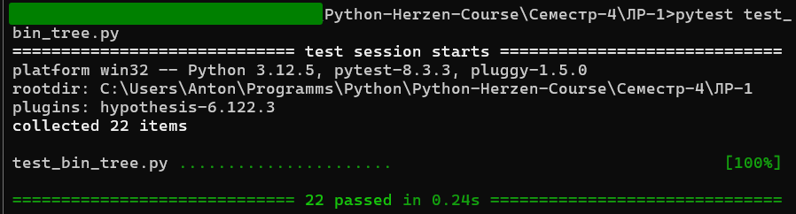

# Лабораторная работа 1. Построение бинарного дерева

### Задание

Разработайте программу на языке Python, которая будет строить бинарное дерево (дерево, в каждом узле которого может быть только два потомка). Отображение результата в виде словаря (как базовый вариант решения задания). Далее исследовать другие структуры, в том числе доступные в модуле collections в качестве контейнеров для хранения структуры бинарного дерева.
Необходимо реализовать рекурсивный и не рекурсивный вариант gen_bin_tree
Алгоритм построения дерева должен учитывать параметры, переданные в качестве аргументов функции.

```python
from collections import deque
from bin_tree_exceptions import InvalidTreeHeight, InvalidTreeRoot, InvalidTreeFunctions

# parameters
height: int = 6
root: int = 5
left_leaf_function = lambda x: x ** 2
right_leaf_function = lambda x: x - 2

# for debugging with prints
height_test: int = 3


def gen_bin_tree_recursive(height: int = 6, root: int = 5, left_function = lambda x: x ** 2, right_function = lambda x: x - 2):
    """
    This function generates a binary tree recursively given a height and a root node.
  
    :param height: The height of the tree.
    :param root: The root node of the tree.
    :param left_function: The function to generate the left leaf of the tree. Default is lambda x: x ** 2.
    :param right_function: The function to generate the right leaf of the tree. Default is lambda x: x - 2.

    :return: The generated binary tree. If height is 0 or less, returns None.
    """
    if not isinstance(height, int):
        raise InvalidTreeHeight(height)     # Custom exception
    if not isinstance(root, int):
        raise InvalidTreeRoot(root)         # Custom exception

    if height <= 0:
        return None
  
    if not callable(left_function) or not callable(right_function):
        raise InvalidTreeFunctions(left_function, right_function)    # Custom exception

    left_leaf:  int = left_function(root)
    right_leaf: int = right_function(root)

    return {
        str(root): [
            gen_bin_tree_recursive(height - 1, left_leaf, left_function, right_function),
            gen_bin_tree_recursive(height - 1, right_leaf, left_function, right_function)
        ]
    }


def gen_bin_tree_iterative(height: int = 6, root: int = 5, left_function = lambda x: x ** 2, right_function = lambda x: x - 2):
    """
    Generates a binary tree iteratively given a height and a root node.

    :param height: The height of the tree. Must be a non-negative integer.
    :param root: The root node of the tree. Must be an integer.
    :param left_function: The function to generate the left leaf of the tree. Default is lambda x: x ** 2.
    :param right_function: The function to generate the right leaf of the tree. Default is lambda x: x - 2.

    :raises InvalidTreeHeight: If the height is not an integer.
    :raises InvalidTreeRoot: If the root is not an integer.
    :raises InvalidTreeFunctions: If either left_function or right_function is not callable.

    :return: The generated binary tree in dictionary form. If height is 0 or less, returns None.
    """

    if not isinstance(height, int):
        raise InvalidTreeHeight(height)
    if not isinstance(root, int):
        raise InvalidTreeRoot(root)
    
    if height <= 0:
        return None
    
    if not callable(left_function) or not callable(right_function):
        raise InvalidTreeFunctions(left_function, right_function)
  
    tree = {}
    stack = deque([(root, height, tree)])
  
    while stack:
        node, level, parent = stack.popleft()

        if level == 0:
            continue
    
        left_leaf:  int = left_function(node)
        right_leaf: int = right_function(node)
    
        parent[str(node)] = [
            {} if level > 1 else None,
            {} if level > 1 else None
        ]
    
        if level > 1:
            stack.append((left_leaf, level - 1, parent[str(node)][0]))
            stack.append((right_leaf, level - 1, parent[str(node)][1]))
    
    return tree


if __name__ == "__main__":
    print(gen_bin_tree_recursive(test_height))
    print(gen_bin_tree_iterative(test_height))
```

Анализ:
<br>
Рекурсивный метод (gen_bin_tree_recursive):

<ol>
    <li>
        Рекурсивная структура естественно соответствует структуре бинарного дерева, где каждый узел порождает два поддерева.
    </li>
    <li>
        Рекурсивный вызов позволяет лаконично описать логику построения дерева.
    </li>
</ol>
Итеративный метод (gen_bin_tree_iterative)
<ol>
    <li>
        Использование очереди позволяет организовать обход дерева по уровням, сохраняя информацию о родителях.
    </li>
    <li>
        За счёт использования deque, более эффективно используется память, что может быть более эффективно при больших деревьях.
    </li>
</ol>
Кастомные сообщения об ошибках предоставляют подробную информацию о том, какие параметры были переданы неверно (например, указывается фактический тип значения).

Вывод программы:

```python
{'5': [{'25': [{'625': [None, None]}, {'23': [None, None]}]}, {'3': [{'9': [None, None]}, {'1': [None, None]}]}]}
{'5': [{'25': [{'625': [None, None]}, {'23': [None, None]}]}, {'3': [{'9': [None, None]}, {'1': [None, None]}]}]}
```

---

<br>

Пользовательские исключения:

```python
class BinTreeException(Exception):
    def __init__(self, message: str = ""):
        """
        Initializes the BinTreeException with an optional message.

        :param message: The exception message. Defaults to an empty string.
        """
        self.message: str = message
  
    def __str__(self):
        """
        Returns the exception message.

        :return: The exception message.
        """
        return self.message

class InvalidTreeParameters(BinTreeException):
    def __init__(self):
        """
        Initializes the InvalidTreeParameters exception with a default message for invalid tree parameters.
        """
        super().__init__("Invalid tree parameters. ")

class InvalidTreeHeight(InvalidTreeParameters):
    def __init__(self, height: int):
        """
        Initializes the InvalidTreeHeight exception with a message describing the invalid height.

        :param height: The invalid height.
        """
        super().__init__()
        self.message += f"Height must be an integer, not {type(height)}. "

class InvalidTreeRoot(InvalidTreeParameters):
    def __init__(self, root: int):
        """
        Initializes the InvalidTreeRoot exception with a message describing the invalid root.

        :param root: The invalid root.
        """
        super().__init__()
        self.message += f"Root must be an integer, not {type(root)}. "

class InvalidTreeFunctions(InvalidTreeParameters):
    def __init__(self, left_function, right_function):
        """
        Initializes the InvalidTreeFunctions exception with a message describing the invalid functions.

        :param left_function: The left leaf/branch function.
        :param right_function: The right leaf/branch function.
        """
        super().__init__()
        if not callable(left_function):
            self.message += f"Left leaf function cannot be called: left_function = {left_function} "
        if not callable(right_function):
            self.message += f"Right leaf function cannot be called: right_function = {right_function} "
```

Анализ:
Все исключения наследуются от BinTreeException, который, в свою очередь, наследует Exception. Это позволяет централизованно управлять всеми исключениями, связанными с бинарным деревом.
InvalidTreeParameters – базовый класс для всех исключений, связанных с некорректными параметрами дерева.
InvalidTreeHeight, InvalidTreeRoot, InvalidTreeFunctions – специализированные классы, уточняющие конкретную проблему.

---

<br>

Тестирование:

```python
import pytest
from bin_tree import gen_bin_tree_recursive, gen_bin_tree_iterative
from bin_tree_exceptions import InvalidTreeHeight, InvalidTreeRoot, InvalidTreeFunctions


class TestBinTreeRecursive:
    def test_gen_bin_tree(self):
        tree = gen_bin_tree_recursive(6, 5, lambda x: x ** 2, lambda x: x - 2)
        assert isinstance(tree, dict)
  
    def test_gen_bin_tree_invalid_height(self):
        with pytest.raises(InvalidTreeHeight):
            gen_bin_tree_recursive("6", 5, lambda x: x ** 2, lambda x: x - 2)
    
    def test_gen_bin_tree_invalid_root(self):
        with pytest.raises(InvalidTreeRoot):
            gen_bin_tree_recursive(6, "5", lambda x: x ** 2, lambda x: x - 2)

    def test_gen_bin_tree_invalid_functions(self):
        with pytest.raises(InvalidTreeFunctions):
            gen_bin_tree_recursive(6, 5, "lambda x: x ** 2", "lambda x: x - 2")
  
    def test_invalid_l_function_is_none(self):
        with pytest.raises(InvalidTreeFunctions):
            gen_bin_tree_recursive(3, 5, left_function=None, right_function=lambda x: x - 1)
  
    def test_invalid_r_function_is_none(self):
        with pytest.raises(InvalidTreeFunctions):
            gen_bin_tree_recursive(3, 5, left_function=lambda x: x + 1, right_function=None)

    def test_gen_bin_tree_empty_tree(self):
        tree = gen_bin_tree_recursive(0, 5, lambda x: x ** 2, lambda x: x - 2)
        assert tree is None

    def test_gen_bin_tree_negative_height(self):
        assert gen_bin_tree_recursive(-1, 5, lambda x: x ** 2, lambda x: x - 2) is None

    def test_gen_bin_tree_negative_root(self):
        assert isinstance(gen_bin_tree_recursive(6, -5, lambda x: x ** 2, lambda x: x - 2), dict)

    def test_custom_functions(self):
        tree = gen_bin_tree_recursive(2, 3, lambda x: x * 2, lambda x: x + 3)
        assert "3" in tree
        left, right = tree["3"]
        assert left == {"6": [None, None]}
        assert right == {"6": [None, None]}
  
    def test_tree_nested_depth(self):
        tree = gen_bin_tree_recursive(3, 5, lambda x: x ** 2, lambda x: x - 2)
        expected_tree = {
            "5": [
                {"25": [{"625": [None, None]}, {"23": [None, None]}]},
                {"3": [{"9": [None, None]}, {"1": [None, None]}]}
            ]
        }
        assert tree == expected_tree

class TestBinTreeIterative:
    def test_gen_bin_tree(self):
        tree = gen_bin_tree_iterative(6, 5, lambda x: x ** 2, lambda x: x - 2)
        assert isinstance(tree, dict)
  
    def test_gen_bin_tree_invalid_height(self):
        with pytest.raises(InvalidTreeHeight):
            gen_bin_tree_iterative("6", 5, lambda x: x ** 2, lambda x: x - 2)
    
    def test_gen_bin_tree_invalid_root(self):
        with pytest.raises(InvalidTreeRoot):
            gen_bin_tree_iterative(6, "5", lambda x: x ** 2, lambda x: x - 2)

    def test_gen_bin_tree_invalid_functions(self):
        with pytest.raises(InvalidTreeFunctions):
            gen_bin_tree_iterative(6, 5, "lambda x: x ** 2", "lambda x: x - 2")
  
    def test_invalid_l_function_is_none(self):
        with pytest.raises(InvalidTreeFunctions):
            gen_bin_tree_iterative(3, 5, left_function=None, right_function=lambda x: x - 1)
  
    def test_invalid_r_function_is_none(self):
        with pytest.raises(InvalidTreeFunctions):
            gen_bin_tree_iterative(3, 5, left_function=lambda x: x + 1, right_function=None)

    def test_gen_bin_tree_empty_tree(self):
        tree = gen_bin_tree_iterative(0, 5, lambda x: x ** 2, lambda x: x - 2)
        assert tree is None

    def test_gen_bin_tree_negative_height(self):
        assert gen_bin_tree_iterative(-1, 5, lambda x: x ** 2, lambda x: x - 2) is None

    def test_gen_bin_tree_negative_root(self):
        assert isinstance(gen_bin_tree_iterative(6, -5, lambda x: x ** 2, lambda x: x - 2), dict)

    def test_custom_functions(self):
        tree = gen_bin_tree_iterative(2, 3, lambda x: x * 2, lambda x: x + 3)
        assert "3" in tree
        left, right = tree["3"]
        assert left == {"6": [None, None]}
        assert right == {"6": [None, None]}
  
    def test_tree_nested_depth(self):
        tree = gen_bin_tree_iterative(3, 5, lambda x: x ** 2, lambda x: x - 2)
        expected_tree = {
            "5": [
                {"25": [{"625": [None, None]}, {"23": [None, None]}]},
                {"3": [{"9": [None, None]}, {"1": [None, None]}]}
            ]
        }
        assert tree == expected_tree


if __name__ == "__main__":
    pytest.main()
```

Вывод программы:
<br>

