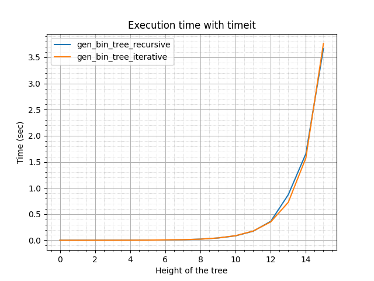
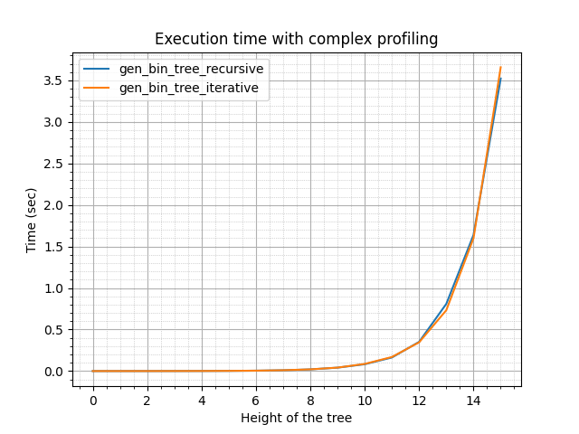

# Лабораторная работа 1. Построение бинарного дерева

### Задание

С использованием борда https://replit.com/@zhukov/prog-4-lr2-1#main.py сравнить реализации (рекурсивной и не рекурсивной) построения бинарного дерева с точки зрения эффективности работы алгоритма (время выполнения) двумя способами:

"timeit" с помощью модуля timeit;
"complex-profiling" с помощью создания специальной оболочки для тестирования (matplotlib, setup_data, timeit).

Для второго способа следует переписать содержимое функции setup_data так, чтобы генерировались не списки чисел (в борде пример генерации данных для сравнения работы функции-факториала), а списки пар чисел (кортеж или словарь, представляющих root и height), также необходимо определить оптимальные значения параметров: количество «прогонов» тестов и длина списка с параметрами для построения деревьев.

Простое профилирование c помощью timeit:

```python
import timeit
import matplotlib.pyplot as plt
from random import randint
from bin_tree.bin_tree import gen_bin_tree_recursive, gen_bin_tree_iterative
from bin_tree.bin_tree_exceptions import InvalidTreeHeight, InvalidTreeRoot
from bin_tree_complex_profiling import setup_plot

# simple timeit profiling
def main():
    max_height:     int = 10    # maximum height of tree to profile
    timeit_runs:    int = 1000  # number of times to run each function
    functions_list: list = [gen_bin_tree_recursive, gen_bin_tree_iterative]
    times:          list = []   # list of execution times

    left_function = lambda x: x * 2 # use of default "left_function = lambda x: x ** 2"
                                    # may result in string overflow at relatively low height
    for func in functions_list:
        for height in range(1, max_height + 1):
            rand_root = randint(1, 100)
            exec_time = timeit.timeit(lambda: func(height, rand_root, left_function=left_function), number=timeit_runs)
            times.append(exec_time)
        plt.plot(times)
        times.clear()

    setup_plot(functions_list, label='Execution time with timeit')
    plt.show()

if __name__ == '__main__':
    main()
```

Анализ:
Простой подход для замера времени построения бинарного дерева.
timeit.timeit() используется для точного измерения времени выполнения. Параметр number=timeit_runs позволяет выполнить код многократно, уменьшая влияние случайных факторов.
Функция для тестирования передаётся, как lambda функция. Такой подход более эффективный, чем передача строки и позволяет пользоваться переменными окружения без использования параметра globals.
Для каждого графика создаётся легенда из списка функция для профилирования. На графике создаётся сетка для большей наглядности времени выполнения.

---

<br>

Использование комплексного подхода для профилирования:

```python
import time
import timeit
import matplotlib.pyplot as plt
from random import randint
from bin_tree.bin_tree import gen_bin_tree_recursive, gen_bin_tree_iterative
from bin_tree.bin_tree_exceptions import InvalidTreeHeight, InvalidTreeRoot, InvalidTreeFunctions


def setup_data(length: int) -> list:
    """
    Sets up a list of tuples containing height and random root values for binary tree generation.

    :param length: The number of tuples to generate. Each tuple contains a height and a root value.
    :return: A list of tuples where each tuple consists of (height, root).
    """

    height_root: list = []
    for i in range(1, length + 1):
        height_root.append((i, randint(1, 100)))  # (height, root)
                                                    # here height is always predetermined sequence 
                                                    # in order to get more accurate results during profiling
                                                    # of different functions
    return height_root

def time_profiler(n_args: int, n_runs: int, func: callable, *args, **kwargs) -> list:
    """
    Profiles the execution time of a given function across multiple runs and arguments.

    :param n_args: Number of argument sets (tuples) for which the function will be profiled.
    :param n_runs: Number of times to execute the function for timing.
    :param func: The function to be profiled.
    :param args: Positional arguments, where each element is a tuple of parameters for the function.
    :param kwargs: Keyword arguments to pass to the function.

    :return: A list of execution times for each set of arguments, measured in seconds.
    """

    run_time = []
    for i in range(n_args):
        # height = args[i][0]
        run_time.append(timeit.timeit(lambda:func(*args[i], **kwargs), number=n_runs))
    return run_time

def setup_plot(functions: list, label: str = None, grid: bool = True, legend: bool = True, savefig: bool = False) -> None:
    """
    Sets up a plot with labels, grid and legend for execution time measurements.

    :param functions: A list of functions to profile.
    :param grid: If True, enables grid. Defaults to True.
    :param legend: If True, enables legend. Defaults to True.
    :param savefig: If True, saves the plot as a file. Defaults to False.
    """
    plt.xlabel('Height of the tree')
    plt.ylabel('Time (sec)')
    if label:
        plt.title(label)
    if grid:
        plt.grid(which='major', linewidth=0.8)
        plt.grid(which='minor', linestyle=':', linewidth=0.5)
        plt.minorticks_on()
    if legend:
        plt.legend(list(map(lambda x: x.__name__, functions)))
    if savefig:
        plt.savefig(f'{list(map(lambda x: x.__name__, functions))}.png')
  
def plot_time(exec_times: list) -> None:
    """
    Plots the execution times of different functions over varying input sizes.

    :param exec_times: A list of lists, where each inner list contains execution times 
                       for a particular function over varying input sizes.
    """

    for exec_time in exec_times:
        plt.plot(exec_time)


def main():
    max_height:     int = 10    # maximum height of tree to profile
    timeit_runs:    int = 1000  # number of times to run each function
    functions_list: list = [    # functions to profile
        gen_bin_tree_recursive, 
        gen_bin_tree_iterative
    ]

    left_function = lambda x: x * 2 # use of default "left_function = lambda x: x ** 2"
                                    # may result in string overflow at relatively low height
  
    times:  list = []                       # list of execution times
    data:   list = setup_data(max_height)   # list of tuples (height, root)

    for func in functions_list:
        exec_time = time_profiler(len(data), timeit_runs, func, *data, left_function=left_function)
        times.append(exec_time)


    plot_time(times)            # plot
    setup_plot(functions_list, label='Execution time with complex profiling')  # set up plot parameters
    plt.show()


if __name__ == '__main__':
    main()
```

Анализ:
Код является переработанной версией простого подхода.
Разделение функций на логические блоки (setup_data(), time_profiler(), plot_time(), setup_plot()) делает код понятным и переиспользуемым.
time_profiler() позволяет тестировать любые функции, принимающие аргументы *args и **kwargs.
setup_plot() позволяет кастомизировать график (включение сетки, сохранение в файл и т. д.)

---

<br>

Вывод программ:



Анализ времени выполнения:
Из графиков времени построения бинарных деревьев следует, что рекурсивная и итеративная реализация выполняются примерно за одно и то же время. Причиной этого является то, что в обоих реализациях происходит генерация одной ветви дерева за одну итерацию, рекурсивную или итерационную. Однако итеративный подход всё же требует больше времени для исполнения.
Сложность алгоритмов близка к O(2^n).
