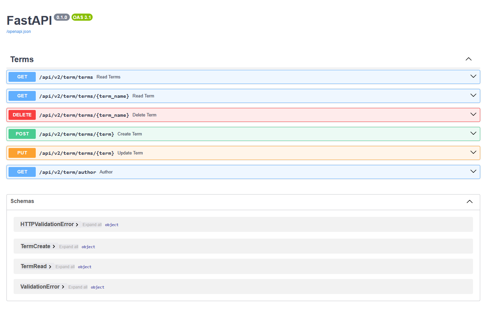

# Лабораторная работа 6. ООП. Приложение на FastAPI + Nginx, Docker-Container

### Задание
Разработать приложение - глоссарий на основе FastAPI, которое будет выполнять следующие функции:
* Получение списка всех терминов.
* Получение информации о конкретном термине по ключевому слову.
* Добавление нового термина с описанием.
* Обновление существующего термина.
* Удаление термина из глоссария.
У вас должен применяться Pydantic для валидации входных данных и формирования схем.
Будет плюсом, если вы:
- найдете и используете по назначению инструмент для автоматической генерации статической документации с помощью встроенной OpenAPI-спецификации FastAPI;
- реализуйте решение в виде контейнера (Docker file) или реализуйте решение с помощью Docker Compose;
- используете для хранения данных SQLite (или другую легковесную БД);
- обеспечите автоматическую миграцию структуры данных при старте приложения.


### Описание программы
Программа — это глоссарий, разработанный на FastAPI. Она позволяет:
* Получать список всех терминов.
* Искать термин по имени.
* Добавлять новый термин.
* Обновлять описание термина.
* Удалять термин.
* Просматривать информацию об авторе и текущей дате.
* Данные хранятся в SQLite-базе данных.

В проекте используются:
* Pydantic-схема для валидации и сериализации данных.
* SQLAlchemy — для ORM-модели Term.
* OpenAPI — встроенная документация (автоматически генерируется FastAPI).

Для развёртывания приложения используется Docker/Docker-Compose + Nginx.



### Структура проекта:
```bash
app/
├── api/
│   └── v2/
|       └── term.py
├── core/
│   ├── config.py
│   └── database.py
├── db/
|   └── logtable.db
├── models/
|   └── term.py
├── patterns/
│   └── patterns.py
├── schemas/
│   └── term.py
├── services/
│   └── term_service.py
├── Dockerfile
├── main.py
└── requirements.txt

nginx/
├── default.conf
└── Dockerfile

docker-compose.yml
```

### FastAPI
v2/term.py
```python
from fastapi import APIRouter, Depends, HTTPException
from sqlalchemy.orm import Session
from core.database import SessionLocal, get_db_session
from models.term import Term
from schemas.term import TermCreate, TermRead
from services.term_service import CRUDTerm

router = APIRouter()


@router.get("/terms", response_model=list[TermRead])
def read_terms(skip: int = 0, limit: int = 10, db: Session = Depends(get_db_session)) -> list[TermRead]:
    """Retrieve terms.

    Args:
        skip (int, optional): skip. Defaults to 0.
        limit (int, optional): limit. Defaults to 10.

    Returns:
        list[TermRead]: list of terms.
    """
    crud = CRUDTerm(db, TermRead)
    return crud.get_all()

@router.get("/terms/{term_name}", response_model=TermRead)
def read_term(term_name, db: Session = Depends(get_db_session)) -> TermRead:
    """Retrieve term by name.

    Args:
        term_name (str): term name.

    Raises:
        HTTPException: 404 if term not found.

    Returns:
        TermRead: term.
    """
    crud = CRUDTerm(db, TermRead)
    term = crud.get(term_name)
    if not term:
        raise HTTPException(status_code=404, detail="Term not found")
    return term

@router.post("/terms/{term}", response_model=TermRead)
def create_term(term: TermCreate = Depends(), db: Session = Depends(get_db_session)) -> TermCreate:
    """Create term.

    Args:
        term (TermCreate): term to create.

    Raises:
        HTTPException: 409 if term already exists.

    Returns:
        TermCreate: created term.
    """
    crud = CRUDTerm(db, Term)
    created = crud.create(term)
    if not created:
        raise HTTPException(status_code=409, detail="Term already exists")
    return created

@router.put("/terms/{term}", response_model=TermCreate)
def update_term(term: TermCreate = Depends(), db: Session = Depends(get_db_session)) -> TermCreate:
    """Update an existing term.

    Args:
        term (TermCreate): The term data to update.
        db (Session): Database session dependency.

    Raises:
        HTTPException: 404 error if the term is not found.

    Returns:
        TermCreate: The updated term data.
    """
    crud = CRUDTerm(db, Term)
    updated = crud.update(term)
    if not updated:
        raise HTTPException(status_code=404, detail="Term not found. Cannot update")
    return updated

@router.delete("/terms/{term_name}")
def delete_term(term_name: str, db: Session = Depends(get_db_session)):
    """Delete term by name.

    Args:
        term_name (str): term name.

    Raises:
        HTTPException: 404 if term not found.

    Returns:
        dict[str, str]: deleted term name with message 'deleted successfully'.
    """
    crud = CRUDTerm(db, Term)
    deleted = crud.delete(term_name)
    if not deleted:
        raise HTTPException(status_code=404, detail="Term not found. Cannot delete")
    return {term_name: "deleted successfully"}


@router.get("/author")
def author() -> dict[str, str]:
    """Return author name and current date/time in Russian locale."""
    from datetime import datetime
    import locale
    locale.setlocale(locale.LC_ALL, 'ru_RU')
    today = datetime.now().strftime("%A, %d.%m.%Y, %H:%M").title()
    return {'author': "Anton", "datetime": f'{today}'}

@router.get('/favicon.ico', include_in_schema=False)
async def favicon() -> None:
    """
    Plug for favicon.ico, returns None to prevent FastAPI from returning 
    a 404 error when it is accessed
    """
    return None
```

database.py
```python
from sqlalchemy import create_engine
from sqlalchemy.orm import sessionmaker, declarative_base, Session
from contextlib import contextmanager
from typing import Generator
import os


FILE_PATH:  str = os.path.dirname(os.path.realpath(__file__))
ROOT_PATH:  str = os.path.dirname(FILE_PATH)
DB_DIR:     str = os.path.join(ROOT_PATH, 'db')
DB_PATH:    str = os.path.join(DB_DIR, 'logtable.db')

if not os.path.exists(DB_DIR):
    os.mkdir(DB_DIR)


SQLALCHEMY_DATABASE_URL = f"sqlite:///{DB_PATH}"

engine = create_engine(SQLALCHEMY_DATABASE_URL, connect_args={"check_same_thread": False})
SessionLocal = sessionmaker(autocommit=False, autoflush=False, bind=engine)
Base = declarative_base()


def get_db_session() -> Generator[Session, None, None]:
    """
    FastAPI dependency that provides a SQLAlchemy session.

    :param Session: the session class to use, defaults to SessionLocal
    :return: a session object
    """
    db = SessionLocal()
    try:
        yield db
    finally:
        db.close()
```

models/term.py
```python
from sqlalchemy import Column, Integer, String
from core.database import Base


class Term(Base):
    __tablename__ = "terms"

    name = Column(String, primary_key=True, index=True, unique=True)
    description = Column(String, index=True)

    def __repr__(self):
        return f"Term(name={self.name}, description={self.description})"
```

schemas/term.py
```python
from sqlalchemy import Column, Integer, String
from core.database import Base


class Term(Base):
    __tablename__ = "terms"

    name = Column(String, primary_key=True, index=True, unique=True)
    description = Column(String, index=True)

    def __repr__(self):
        return f"Term(name={self.name}, description={self.description})"
```

term_service.py
```python
from sqlalchemy import Column, Integer, String
from core.database import Base


class Term(Base):
    __tablename__ = "terms"

    name = Column(String, primary_key=True, index=True, unique=True)
    description = Column(String, index=True)

    def __repr__(self):
        return f"Term(name={self.name}, description={self.description})"
```

main.py
```python
from fastapi import FastAPI
from api.v2 import term

from core.database import Base, engine

Base.metadata.create_all(bind=engine)

app = FastAPI()

# Routers
app.include_router(term.router, prefix="/api/v2/term", tags=["Terms"])

@app.on_event("startup")
def on_startup():
    Base.metadata.create_all(bind=engine)
```

Dockerfile
```dockerfile
FROM python:3.12-alpine

# Install dependencies
RUN apk add --no-cache gcc musl-dev libffi-dev

# Set workdir
WORKDIR /app

# Copy app files
COPY requirements.txt .
RUN pip install --no-cache-dir -r requirements.txt

COPY . .

# Run using uvicorn
CMD ["uvicorn", "main:app", "--host", "0.0.0.0", "--port", "8000"]
```


### Nginx
default.conf
```nginx
server {
    listen 80;

    location / {
        proxy_pass http://fastapi:8000;
        proxy_set_header Host $host;
        proxy_set_header X-Real-IP $remote_addr;
        proxy_set_header X-Forwarded-For $proxy_add_x_forwarded_for;
        proxy_set_header X-Forwarded-Proto $scheme;
    }
}
```

Dockerfile
```dockerfile
FROM nginx:alpine

# Copy custom config
COPY default.conf /etc/nginx/conf.d/default.conf
```


### Docker-Compose
```yaml
name: fastapi-nginx

services:
  fastapi:
    build: ./app
    container_name: fastapi_app
    expose:
      - 8000
    networks:
      - app-network

  nginx:
    build: ./nginx
    container_name: nginx_proxy
    ports:
      - "80:80"
    depends_on:
      - fastapi
    networks:
      - app-network

networks:
  app-network:
    driver: bridge
```
