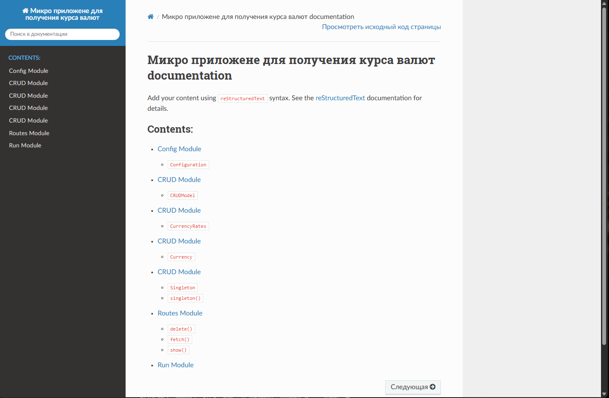

# Лабораторная работа 7. Sphinx

### Задание
Реализовать развертывание проекта на Sphinx и продемонстрировать это развертывание и его результат в отчете.

### Реализация

Для развёртывания документации Sphinx на примере ЛР-5 была создана следующая структура проекта:

```bash
├── .github
│   └── workflows
│       └── deploy.yml
├── docs
├── project
│   ├── __init__.py
│   ├── config.py
│   ├── crud_model.py
│   ├── currency_rates.py
│   ├── currency.py
│   ├── patterns.py
│   ├── routes.py
│   └── run.py
└── requirements.txt
```
В директории `docs` была выполнена команда для инициализации Sphinx:

```bash
sphinx-quickstart
```

В директории `docs` в файле `conf.py` была указана директория проекта:
```python
...

sys.path.insert(0, os.path.abspath('../project'))

# -- Project information -----------------------------------------------------
...
```
А также добавлены расширения:
```python
...
extensions = [
    'sphinx.ext.autodoc',
    'sphinx.ext.napoleon',
    'sphinx.ext.viewcode',
    'sphinx_autodoc_typehints',
]
...
```
и тема:
```python
...
html_theme = 'sphinx_rtd_theme'
...
```


Также были созданы фалы, соответствующие файлам проекта:
* `confing.rst`:
```rst
Config Module
=============

.. automodule:: config
   :members:
   :undoc-members:
   :show-inheritance:
```

* `crud_model.rst`:
```rst
CRUD Module
=============

.. automodule:: app.models.crud_model
   :members:
   :undoc-members:
   :show-inheritance:
```

* `currency_rates.rst`:
```rst
CRUD Module
=============

.. automodule:: app.services.currency_rates
   :members:
   :undoc-members:
   :show-inheritance:
```

* `currency.rst`:
```rst
CRUD Module
=============

.. automodule:: app.models.currency
   :members:
   :undoc-members:
   :show-inheritance:
```

* `patterns.rst`:
```rst
CRUD Module
=============

.. automodule:: app.patterns.patterns
   :members:
   :undoc-members:
   :show-inheritance:
```

* `routes.rst`:
```rst
Routes Module
=============

.. automodule:: app.controllers.routes
   :members:
   :undoc-members:
   :show-inheritance:
```

* `run.rst`:
```rst
Run Module
=============

.. automodule:: run
   :members:
   :undoc-members:
   :show-inheritance:
```

Каждый модуль был подключен в `index.rst`:
```rst
.. Микро приложене для получения курса валют documentation master file, created by
   sphinx-quickstart on Thu May 22 22:15:35 2025.
   You can adapt this file completely to your liking, but it should at least
   contain the root `toctree` directive.

Микро приложене для получения курса валют documentation
=======================================================

.. toctree::
   :maxdepth: 2
   :caption: Contents:

   config
   crud_model
   currency_rates
   currency
   patterns
   routes
   run
```

Для генерации документации была выполнена команда:

```bash
make.bat html
```

В результате была создана документацию в директории `_build/html`
Локальный просмотр документации:


### Развёртывание документации на GitHub Pages
В корне проекта была создана директория `.github/workflows/deploy.yml`

```yaml
name: Build-sphinx-docs

# Controls when the workflow will run
on:
  # Triggers the workflow on push or pull request events but only for the main branch
  push:
    branches: [ master ]
  pull_request:
    branches: [ master ]

  # Allows you to run this workflow manually from the Actions tab
  workflow_dispatch:

# A workflow run is made up of one or more jobs that can run sequentially or in parallel
jobs: 
  # This workflow contains a single job called "build"
  build: 
    # The type of runner that the job will run on
    runs-on: ubuntu-latest

    # Steps represent a sequence of tasks that will be executed as part of the job
    steps:
      # Checks-out your repository under $GITHUB_WORKSPACE, so your job can access it
      - uses: actions/checkout@v2

      - name: Set up Python 3.10
        uses: actions/setup-python@v2
        with:
           python-version: "3.10"
      # Runs a single command using the runners shell
      - name: Run a one-line script
        run: echo Hello, world!
        
      - name: Install dependencies
        run: | 
          python -m pip install --upgrade pip
          pip install -r requirements.txt
      - name: Build HTML
        run: | 
          cd docs/
          make html
      - name: Run ghp-import
        run: | 
          ghp-import -n -p -f docs/_build/html

      # Runs a set of commands using the runners shell
      - name: Run a multi-line script
        run: |
          echo Add other actions to build,
          echo test, and deploy your project.
```


После чего был создан [данный](https://github.com/AntSib/Flask_Sphinx_demo) репозиторий на GitHub. В нём была создана ветка `master`, в которую была выгружена документация.

yaml скрипт создал ветку `gh-pages`, в которой была сгенерирована документация.

Документацию проекта можно посмотреть [здесь](https://antsib.github.io/Flask_Sphinx_demo/) на GitHub Pages.


