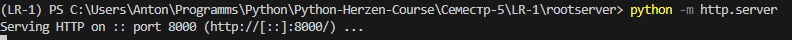
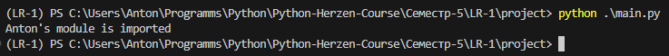
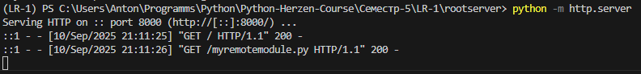

# Лабораторная работа №1 Реализация удаленного импорта

### Описание

Программа реализует удалённый импорт Python-модулей: добавляет в sys.path_hooks собственный обработчик (url_hook), который загружает список доступных файлов по URL, а затем при импорте подтягивает код модуля по сети и выполняет его. В итоге можно подключать и использовать модули, расположенные на удалённом сервере, как если бы они были локальными.

### Анализ

Программа демонстрирует работу с механизмом импорта через:

* sys.path_hooks и собственный finder/loader (URLFinder, URLLoader) для динамического поиска и загрузки кода;
* сетевое взаимодействие с помощью requests для получения исполняемого кода модуля;
* динамическую компиляцию и выполнение кода через compile + exec.

### Демонстрация работы программы

Запуск локального сервера с помощью `python3 -m http.server 8000`:

Результат работы main.py:

Ответ сервера:

