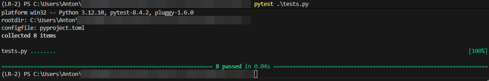

# Лабораторная работа 4. Ряд Фибоначчи с помощью итераторов

Лабораторная работа состоит из двух подзаданий: 
1. Создание сопрограммы на основе кода, позволяющей по данному n сгенерировать список элементов из ряда Фибоначчи.
2. Создание программы, возвращающей список чисел Фибоначчи с помощью итератора.


## Задание 1
Hазработать сопрограмму (_корутину_), реализующую возвращение списка элементов ряда Фибоначчи. 

```python
>> gen = my_genn()

>> gen.send(3) 
[0, 1, 1] 

>> gen.send(5) 
[0, 1, 1, 2, 3] 

>> gen.send(8) 
[0, 1, 1, 2, 3, 5, 8, 13] 
```

Требуется написать необходимые тесты в файле ```test_fib.py```.


Код:

```python
# coroutine_fib.py
import functools


def coroutine(func: callable) -> callable:
    """
    A decorator that primes a generator for use.

    Args:
        func (callable): A generator function.

    Returns:
        callable: A generator function that has been primed.
    """
    @functools.wraps(func)
    def wrapper(*args, **kwargs):
        generator = func(*args, **kwargs)
        next(generator)
        return generator
    return wrapper


@coroutine
def gen_fib() -> list[int]:
    """
    A generator that yields a Fibonacci sequence of a given length.

    The generator takes an integer as input and yields a list 
    of integers representing the Fibonacci sequence of that length.

    Args:
        n (int): The length of the Fibonacci sequence.

    Yields:
        list[int]: A list of integers representing the Fibonacci sequence of length n.
    """
    n = yield
    while True:
        if not isinstance(n, int) or n < 0:
            raise TypeError("Non-integer or negative value is not allowed")

        a, b = 0, 1
        fib_seq = []
        for _ in range(n):
            fib_seq.append(a)
            a, b = b, a + b

        n = yield fib_seq


if __name__ == "__main__":
    gen = gen_fib()
    print(gen.send(3))
    print(gen.send(8))
    print(gen.send(5))
```

### Результат выполнения программы
```bash
python .\coroutine_fib.py
[0, 1, 1]
[0, 1, 1, 2, 3, 5, 8, 13]
[0, 1, 1, 2, 3]
```

### Описание программы

Программа реализует сопрограмму (корутину) gen_fib, которая принимает число n и возвращает список первых n чисел ряда Фибоначчи. Для удобства используется декоратор coroutine, который автоматически инициализирует генератор (выполняет первый next).


### Анализ

Код демонстрирует применение сопрограмм для ленивой генерации данных. Вместо классической функции возврата списка используется генератор, способный продолжать работу и принимать новые значения через send(). Это соответствует теме "удалённого импорта" в том смысле, что данные вычисляются по запросу и возвращаются частями. Также реализована базовая защита от ошибок (исключение при неверном типе или отрицательном аргументе).


### Тесты
```python
# tests.py
import pytest
from coroutine_fib import gen_fib


class TestFibonacciCoroutine:
    @pytest.mark.parametrize(
        "n, expected",
        [
            (3, [0, 1, 1]),
            (5, [0, 1, 1, 2, 3]),
            (9, [0, 1, 1, 2, 3, 5, 8, 13, 21])
        ]
    )
    def test_sequence(self, n, expected):
        """Test the Fibonacci generator.

        This test checks that the Fibonacci generator returns the correct Fibonacci sequence
        for a given input 'n'. The test uses various test cases with expected results.

        :param n: The length of the Fibonacci sequence to generate.
        :param expected: The expected Fibonacci sequence of length 'n'.
        """
        gen = gen_fib()
        assert gen.send(n) == expected

    def test_sequence_0(self):
        """Test that the Fibonacci generator returns an empty list when given input 0."""
        gen = gen_fib()
        assert gen.send(0) == []

    def test_negative_input(self):
        """Test that the Fibonacci generator raises a TypeError when given a negative input."""
        gen = gen_fib()
        with pytest.raises(TypeError):
            gen.send(-1)
            
    def test_float_as_input(self):
        """Test that the Fibonacci generator raises a TypeError when given a float input."""
        gen = gen_fib()
        with pytest.raises(TypeError):
            gen.send(2.5)
    
    def test_string_as_input(self):
        """Test that the Fibonacci generator raises a TypeError when given a string input."""
        gen = gen_fib()
        with pytest.raises(TypeError):
            gen.send('2')
    
    def test_none_as_input(self):
        """Test that the Fibonacci generator raises a TypeError when given None as input."""
        gen = gen_fib()
        with pytest.raises(TypeError):
            gen.send()


if __name__ == "__main__":
    pytest.main()
    
```

### Результат тестов


## Задание 2

Дополните код классом FibonacchiLst, который бы позволял перебирать элементы из ряда Фибоначчи по данному ей списку. Итератор должен вернуть очередное значение, которое принадлежит ряду Фибоначчи, из данного ей списка. Например: для lst = [0, 1, 2, 3, 4, 5, 6, 7, 8, 9, 1], FibonacchiLst должен вернуть [0, 1, 2, 3, 5, 8, 1]

Решение может быть выполнено с помощью реализации содержимого методов \_\_init\_\_,\_\_iter\_\_, \_\_next\_\_ или с помощью реализации метода \_\_getitem\_\_.

Код:
```python
# coroutine_fib.py
class FibonacciList:
    def __init__(self, input_list: list[int]):
        self.input_list = input_list
        self.__check_input()
        self.__index = 0
        self._fib_set = self._generate_fib_up_to(limit=max(self.input_list))

    def __iter__(self):
        return self

    def __next__(self):
        """Returns the next Fibonacci number from the input list."""
        while True:
            try:
                value: int = self.input_list[self.__index]
            except IndexError:
                raise StopIteration

            self.__index += 1

            if value in self._fib_set:
                return value
    
    def _generate_fib_up_to(self, limit: int = 0) -> set[int]:
        """Generates a set of Fibonacci numbers up to the given limit."""
        fib_set: set = {0, 1}
        a, b = 0, 1
        while a <= limit:
            a, b = b, a + b
            fib_set.add(a)
        
        return fib_set

    def __check_input(self):
        """
        Checks that the input is a list and contains only integers.

        Raises a TypeError if the input is incorrect.
        """
        if not isinstance(self.input_list, list):
            raise TypeError("Input must be a list")

        if not all(isinstance(value, int) for value in self.input_list):
            raise TypeError("Non-integer value is not allowed in list")


class FibonacciListGetItem:
    def __init__(self, input_list: list[int]):
        self.input_list = input_list
        self.__check_input()
        self._fib_set = self._generate_fib_up_to(max(input_list))
        self._filtered = [n for n in input_list if n in self._fib_set]

    def _generate_fib_up_to(self, limit: int = 0) -> set[int]:
        """Generates a set of Fibonacci numbers up to the given limit."""
        fib_set: set = {0, 1}
        a, b = 0, 1
        while a <= limit:
            a, b = b, a + b
            fib_set.add(a)
        
        return fib_set

    def __getitem__(self, index: int) -> int:
        """Provide index access to filtered Fibonacci numbers."""
        return self._filtered[index]

    def __len__(self) -> int:
        """Allow len() to be used on the object."""
        return len(self._filtered)
    
    def __check_input(self):
        """
        Checks that the input is a list and contains only integers.

        Raises a TypeError if the input is incorrect.
        """
        if not isinstance(self.input_list, list):
            raise TypeError("Input must be a list")

        if not all(isinstance(value, int) for value in self.input_list):
            raise TypeError("Non-integer value is not allowed in list")


def run_fib_next():
    print("FibonacciList class")
    nums = [1, 2, 3, 4, 5, 8, 13, 21, 34, 55, 100, 144, 200]
    fib_list = FibonacciList(nums)
    print(list(fib_list))


def run_fib_getitem():
    print("FibonacciListGetItem class")
    nums = [1, 2, 3, 4, 5, 8, 13, 21, 34, 55, 100, 144, 200]
    fib_filter = FibonacciListGetItem(nums)
    print(list(fib_filter))
    print(fib_filter[3])


if __name__ == "__main__":
    run_fib_next()
    run_fib_getitem()
    
```

### Результат работы программы
```bash
python .\fibonaccilist.py
FibonacciList class
[1, 2, 3, 5, 8, 13, 21, 34, 55, 144]
FibonacciListGetItem class
[1, 2, 3, 5, 8, 13, 21, 34, 55, 144]
5
```

### Описание программы

Программа реализует два класса для фильтрации чисел из списка, оставляя только элементы, принадлежащие ряду Фибоначчи.
* FibonacciList использует протокол итератора (\_\_iter\_\_, \_\_next\_\_).
* FibonacciListGetItem использует доступ по индексу (\_\_getitem\_\_, \_\_len\_\_).

### Анализ

Задача демонстрирует два способа создания пользовательских коллекций в Python:
Итератор через \_\_iter\_\_/\_\_next\_\_, где перебор выполняется "на лету".
Индексация через \_\_getitem\_\_, где заранее формируется отфильтрованный список.

Таким образом показаны разные механизмы протоколов итерации Python: ленивый (итератор) и индексируемый (последовательность).
