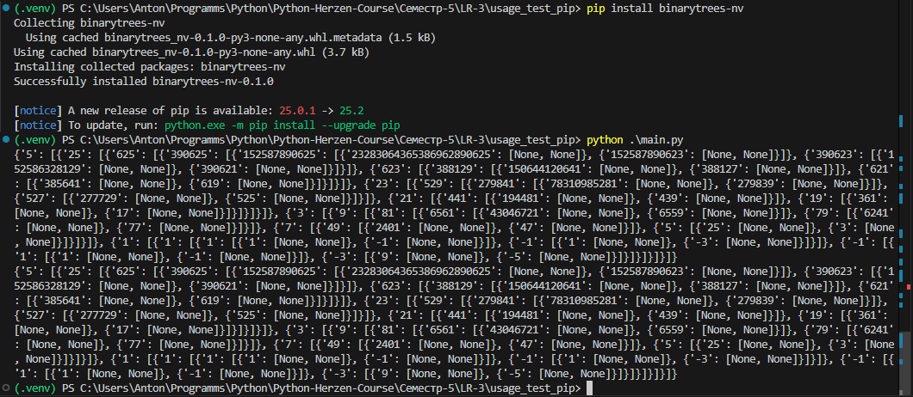
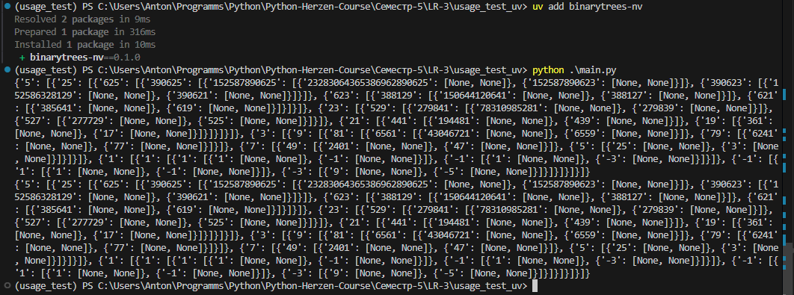

# Лабораторная работа №3. Создание своего пакета. Публикация на pypi

Исследуйте устройство нескольких пакетов, опубликованных на pypi. Например, 
* requests
* yandex-weather-api
* python-open-weather
Преобразуйте (выполните рефакторинг) вашего существующего проекта к виду, возможному для публикации в PyPI.

## Разработка собственного пакета
В качестве пакета был выбран модуль для создания бинарного дерева.
На его основе был создан пакет, включающий в себя модуль с функциями бинарных деревьев, исключений и тесты.


### Структура пакета

```
└── BinaryTreePackage
    ├── src
    │   └── binarytrees_nv
    │       ├── __init__.py
    │       ├── binarytrees_nv.py
    │       └── exceptions.py
    ├── tests
    │   ├── __init__.py
    │   └── test_binarytrees_nv.py
    ├── LICENSE
    ├── pyproject.toml
    └── README.md
```

```python
# src/__init__.py

from .binarytrees_nv import gen_bin_tree_iterative, gen_bin_tree_recursive
from .exceptions import InvalidTreeFunctions, InvalidTreeHeight, InvalidTreeRoot

__all__ = [
    "InvalidTreeFunctions",
    "InvalidTreeHeight",
    "InvalidTreeRoot",
    "gen_bin_tree_iterative",
    "gen_bin_tree_recursive",
]

__version__ = "0.1.0"
```

```python
# src/binarytrees_nv.py

from collections import deque

from .exceptions import (
    InvalidTreeFunctions,
    InvalidTreeHeight,
    InvalidTreeRoot,
)


def leaf_function(x):
    """Example function to generate the left/right leaf of a binary tree given a node."""
    return x**2


def gen_bin_tree_recursive(
    height: int,
    root: int = 1,
    left_function=lambda x: x,
    right_function=lambda x: x,
):
    """
    Generates a binary tree recursively given a height and a root node.

    Args:
        height (int): The height of the tree.
        root (int): The root node of the tree.
        left_function (callable): The function to generate the left leaf of the tree. Default is lambda x: x.
        right_function (callable): The function to generate the right leaf of the tree. Default is lambda x: x.

    Raises:
        InvalidTreeHeight: If the height is not an integer.
        InvalidTreeRoot: If the root is not an integer.
        InvalidTreeFunctions: If either left_function or right_function is not callable.

    Returns:
        The generated binary tree. If height is 0 or less, returns None.

    """
    if not isinstance(height, int):
        raise InvalidTreeHeight(height)  # Custom exception
    if not isinstance(root, int):
        raise InvalidTreeRoot(root)  # Custom exception

    if height <= 0:
        return None

    if not callable(left_function) or not callable(right_function):
        raise InvalidTreeFunctions(left_function, right_function)  # Custom exception

    left_leaf: int = left_function(root)
    right_leaf: int = right_function(root)

    return {
        str(root): [
            gen_bin_tree_recursive(
                height - 1,
                left_leaf,
                left_function,
                right_function,
            ),
            gen_bin_tree_recursive(
                height - 1,
                right_leaf,
                left_function,
                right_function,
            ),
        ],
    }


def gen_bin_tree_iterative(
    height: int,
    root: int = 1,
    left_function=lambda x: x,
    right_function=lambda x: x,
):
    """
    Generates a binary tree iteratively given a height and a root node.

    Args:
        height (int): The height of the tree. Must be a non-negative integer.
        root (int): The root node of the tree. Must be an integer.
        left_function (callable): The function to generate the left leaf of the tree. Default is lambda x: x.
        right_function (callable): The function to generate the right leaf of the tree. Default is lambda x: x.

    Raises:
        InvalidTreeHeight: If the height is not an integer.
        InvalidTreeRoot: If the root is not an integer.
        InvalidTreeFunctions: If either left_function or right_function is not callable.

    Returns:
        The generated binary tree in dictionary form. If height is 0 or less, returns None.

    """
    if not isinstance(height, int):
        raise InvalidTreeHeight(height)
    if not isinstance(root, int):
        raise InvalidTreeRoot(root)

    if height <= 0:
        return None

    if not callable(left_function) or not callable(right_function):
        raise InvalidTreeFunctions(left_function, right_function)

    tree = {}
    stack = deque([(root, height, tree)])

    while stack:
        node, level, parent = stack.popleft()

        left_leaf: int = left_function(node)
        right_leaf: int = right_function(node)

        parent[str(node)] = [{} if level > 1 else None, {} if level > 1 else None]

        if level > 1:
            stack.append((left_leaf, level - 1, parent[str(node)][0]))
            stack.append((right_leaf, level - 1, parent[str(node)][1]))

    return tree
```

```python
# src/exceptions.py

class BinTreeException(Exception):
    def __init__(self, message: str = ""):
        """
        Initializes the BinTreeException with an optional message.

        :param message: The exception message. Defaults to an empty string.
        """
        self.message: str = message

    def __str__(self):
        """
        Returns the exception message.

        :return: The exception message.
        """
        return self.message


class InvalidTreeParameters(BinTreeException):
    def __init__(self):
        """Initializes the InvalidTreeParameters exception with a default message for invalid tree parameters."""
        super().__init__("Invalid tree parameters. ")


class InvalidTreeHeight(InvalidTreeParameters):
    def __init__(self, height: int):
        """
        Initializes the InvalidTreeHeight exception with a message describing the invalid height.

        Args:
            height (int): The invalid height.

        """
        super().__init__()
        self.message += f"Height must be an integer, not {type(height)}. "


class InvalidTreeRoot(InvalidTreeParameters):
    def __init__(self, root: int):
        """
        Initializes the InvalidTreeRoot exception with a message describing the invalid root.

        Args:
            root (int): The invalid root.

        """
        super().__init__()
        self.message += f"Root must be an integer, not {type(root)}. "


class InvalidTreeFunctions(InvalidTreeParameters):
    def __init__(self, left_function, right_function):
        """
        Initializes the InvalidTreeFunctions exception with a message describing the invalid functions.

        Args:
            left_function: The left leaf/branch function.
            right_function: The right leaf/branch function.

        """
        super().__init__()
        if not callable(left_function):
            self.message += (
                f"Left leaf function cannot be called: left_function = {left_function} "
            )
        if not callable(right_function):
            self.message += f"Right leaf function cannot be called: right_function = {right_function} "
```

```python
# tests/__init__.py

from .test_binarytrees_nv import TestBinTreeIterative, TestBinTreeRecursive

__all__ = ["TestBinTreeIterative", "TestBinTreeRecursive"]

__version__ = "0.1.0"
```

```python
# tests/test_binarytrees_nv.py

import pytest
from binarytrees_nv.binarytrees_nv import gen_bin_tree_iterative, gen_bin_tree_recursive
from binarytrees_nv.exceptions import (
    InvalidTreeFunctions,
    InvalidTreeHeight,
    InvalidTreeRoot,
)


class TestBinTreeRecursive:
    def test_gen_bin_tree(self):
        tree = gen_bin_tree_recursive(6, 5, lambda x: x**2, lambda x: x - 2)
        assert isinstance(tree, dict)

    def test_gen_bin_tree_invalid_height(self):
        with pytest.raises(InvalidTreeHeight):
            gen_bin_tree_recursive("6", 5, lambda x: x**2, lambda x: x - 2)

    def test_gen_bin_tree_invalid_root(self):
        with pytest.raises(InvalidTreeRoot):
            gen_bin_tree_recursive(6, "5", lambda x: x**2, lambda x: x - 2)

    def test_gen_bin_tree_invalid_functions(self):
        with pytest.raises(InvalidTreeFunctions):
            gen_bin_tree_recursive(6, 5, "lambda x: x ** 2", "lambda x: x - 2")

    def test_invalid_l_function_is_none(self):
        with pytest.raises(InvalidTreeFunctions):
            gen_bin_tree_recursive(3, 5, None, lambda x: x - 1)

    def test_invalid_r_function_is_none(self):
        with pytest.raises(InvalidTreeFunctions):
            gen_bin_tree_recursive(3, 5, lambda x: x + 1, None)

    def test_gen_bin_tree_empty_tree(self):
        tree = gen_bin_tree_recursive(0, 5, lambda x: x**2, lambda x: x - 2)
        assert tree is None

    def test_gen_bin_tree_negative_height(self):
        assert gen_bin_tree_recursive(-1, 5, lambda x: x**2, lambda x: x - 2) is None

    def test_gen_bin_tree_negative_root(self):
        assert isinstance(
            gen_bin_tree_recursive(6, -5, lambda x: x**2, lambda x: x - 2),
            dict,
        )

    def test_custom_functions(self):
        tree = gen_bin_tree_recursive(2, 3, lambda x: x * 2, lambda x: x + 3)
        assert "3" in tree
        left, right = tree["3"]
        assert left == {"6": [None, None]}
        assert right == {"6": [None, None]}

    def test_tree_nested_depth(self):
        tree = gen_bin_tree_recursive(3, 5, lambda x: x**2, lambda x: x - 2)
        expected_tree = {
            "5": [
                {"25": [{"625": [None, None]}, {"23": [None, None]}]},
                {"3": [{"9": [None, None]}, {"1": [None, None]}]},
            ],
        }
        assert tree == expected_tree


class TestBinTreeIterative:
    def test_gen_bin_tree(self):
        tree = gen_bin_tree_iterative(6, 5, lambda x: x**2, lambda x: x - 2)
        assert isinstance(tree, dict)

    def test_gen_bin_tree_invalid_height(self):
        with pytest.raises(InvalidTreeHeight):
            gen_bin_tree_iterative("6", 5, lambda x: x**2, lambda x: x - 2)

    def test_gen_bin_tree_invalid_root(self):
        with pytest.raises(InvalidTreeRoot):
            gen_bin_tree_iterative(6, "5", lambda x: x**2, lambda x: x - 2)

    def test_gen_bin_tree_invalid_functions(self):
        with pytest.raises(InvalidTreeFunctions):
            gen_bin_tree_iterative(6, 5, "lambda x: x ** 2", "lambda x: x - 2")

    def test_invalid_l_function_is_none(self):
        with pytest.raises(InvalidTreeFunctions):
            gen_bin_tree_iterative(
                3,
                5,
                left_function=None,
                right_function=lambda x: x - 1,
            )

    def test_invalid_r_function_is_none(self):
        with pytest.raises(InvalidTreeFunctions):
            gen_bin_tree_iterative(
                3,
                5,
                left_function=lambda x: x + 1,
                right_function=None,
            )

    def test_gen_bin_tree_empty_tree(self):
        tree = gen_bin_tree_iterative(0, 5, lambda x: x**2, lambda x: x - 2)
        assert tree is None

    def test_gen_bin_tree_negative_height(self):
        assert gen_bin_tree_iterative(-1, 5, lambda x: x**2, lambda x: x - 2) is None

    def test_gen_bin_tree_negative_root(self):
        assert isinstance(
            gen_bin_tree_iterative(6, -5, lambda x: x**2, lambda x: x - 2),
            dict,
        )

    def test_custom_functions(self):
        tree = gen_bin_tree_iterative(2, 3, lambda x: x * 2, lambda x: x + 3)
        assert "3" in tree
        left, right = tree["3"]
        assert left == {"6": [None, None]}
        assert right == {"6": [None, None]}

    def test_tree_nested_depth(self):
        tree = gen_bin_tree_iterative(3, 5, lambda x: x**2, lambda x: x - 2)
        expected_tree = {
            "5": [
                {"25": [{"625": [None, None]}, {"23": [None, None]}]},
                {"3": [{"9": [None, None]}, {"1": [None, None]}]},
            ],
        }
        assert tree == expected_tree


if __name__ == "__main__":
    pytest.main()
```


### Публикация в PyPi с помощью менеджера пакетов uv

```bash
uv build

uv publish -t <TOKEN> --publish-url https://upload.pypi.org/legacy/
```

[Ссылка](https://pypi.org/project/binarytrees-nv/) на публикацию.

### Пример использования библиотеки

* с помощью pip
```bash
pip install binarytrees_nv
```

* с помощью uv
```bash
uv add binarytrees_nv
```

Протестирует работоспособность библиотеки с помощью кода:

```python
from binarytrees_nv import gen_bin_tree_iterative, gen_bin_tree_recursive


def main():
    recursive_tree = gen_bin_tree_recursive(6, 5, lambda x: x**2, lambda x: x - 2)
    iterative_tree = gen_bin_tree_iterative(6, 5, lambda x: x**2, lambda x: x - 2)

    print(recursive_tree)
    print(iterative_tree)


if __name__ == "__main__":
    main()
```

Результат установки и выполнения:
<br>
С помощью pip:

<br>
С помощью uv:



