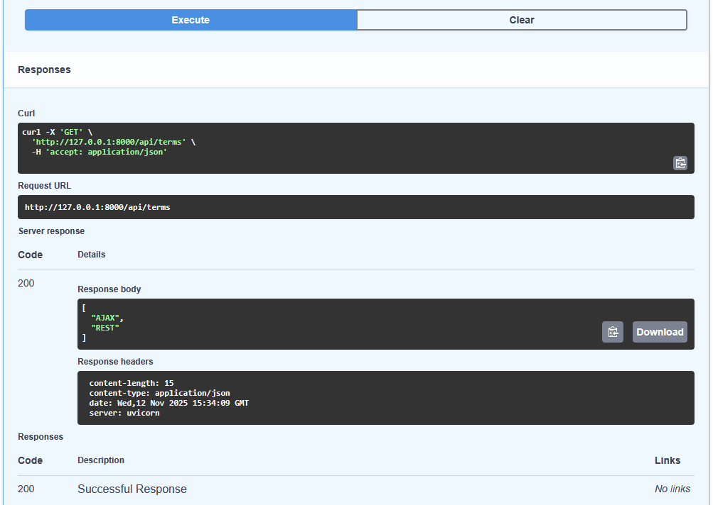
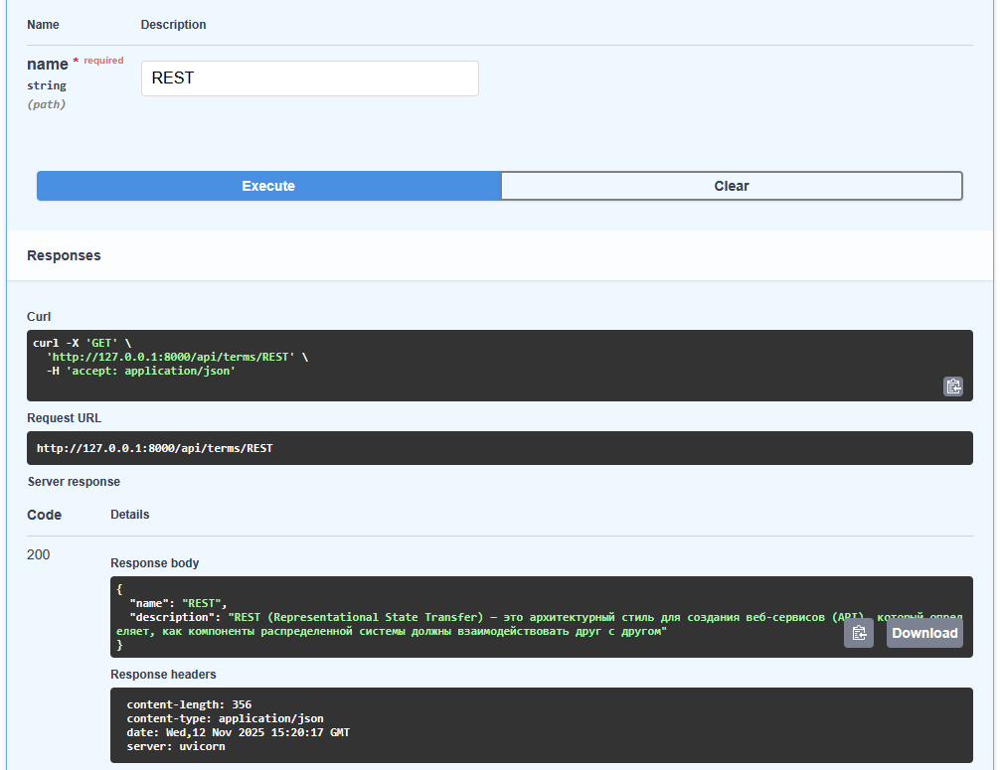
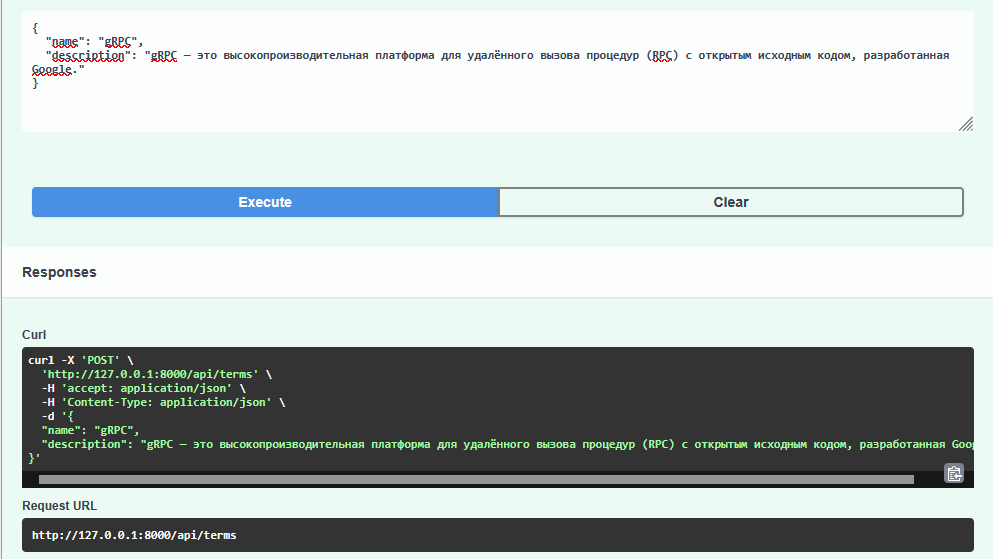
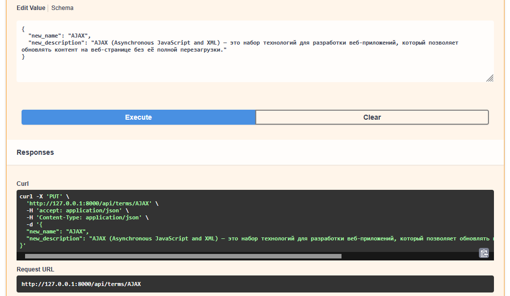
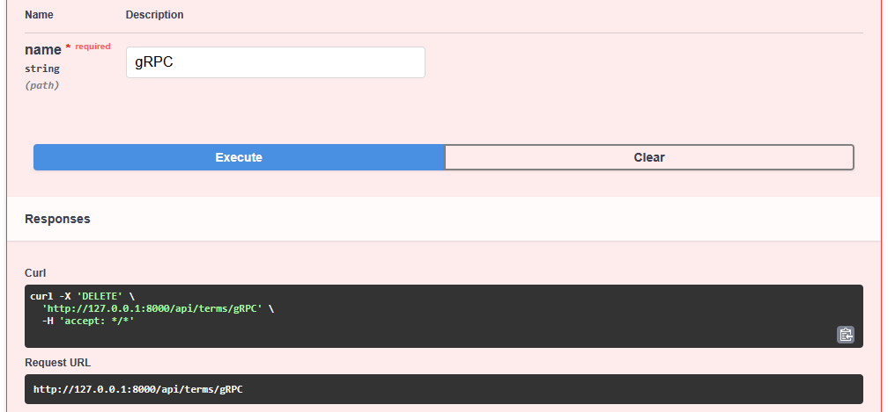

# Лабораторная работа 5. REST API, gRPC, Protobuf

**Задание**: Создать полный глоссарий употребляемых терминов по определённой области и спроектировать доступ к нему в виде Web API в Docker-контейнере.

### Структура проекта

```
glossary_project/
├─ app/
│  ├─ __init__.py
│  ├─ main.py
│  ├─ db/
│  │  ├─ __init__.py
│  │  └─ session.py
│  ├─ models.py
│  ├─ schemas.py
│  ├─ crud.py
│  ├─ api/
│  │  ├─ __init__.py
│  │  └─ routers.py
│  ├─ grpc_server/
│  │  ├─ __init__.py
│  │  └─ server.py
│  └─ grpc/
│     ├─ __init__.py
│     ├─ glossary_pb2.py
│     └─ glossary_pb2_grpc.py
├─ proto/
│  └─ glossary.proto
├─ alembic/
│  ├─ env.py
│  ├─ script.py.mako
│  └─ versions/
├─ generate_proto.sh
├─ Dockerfile
├─ docker-compose.yml
└─ requirements.txt
```


### Описание программы

Была разработана программа, реализованная на основе веб-фреймворка FastAPI. Приложение предоставляет доступ к базе данных терминов через REST API и gRPC. Для описания структуры данных и обмена сообщениями использован Protobuf.

Хранение терминов и их описаний осуществляется в базе данных SQLite, а взаимодействие с ней — через ORM SQLAlchemy. Для проверки и сериализации входных и выходных данных применяется Pydantic.

Приложение поддерживает основные операции CRUD:
* получение списка всех терминов;
* получение информации о конкретном термине по названию;
* добавление нового термина с описанием;
* обновление названия и описания термина;
* удаление термина.

Для контейнеризации приложения была подготовлена Docker-конфигурация, включающая инструкции по сборке и запуску сервиса. Также был создан bash-скрипт (.sh) для автоматической генерации Python-кода из `.proto`-файлов, что упрощает процесс обновления gRPC-интерфейсов при изменении схемы данных.

Была предпринята попытка автоматической миграции структуры базы данных при помощи Alembic, однако этот функционал остался частично реализованным.


### Работа программы

Запросы выполнялить через встроенный в FastAPI Swagger UI (`http://127.0.0.1:8000/docs`).

Просмотр списка терминов:


Просмотр информации о конкретном термине:


Создание термина:


Обновление термина:


Удаление термина:



### Анализ

gRPC и Protobuf позволяют создавать строго типизированные и эффективные интерфейсы для обмена данными между сервисами, что важно при масштабировании.

Реализованный глоссарий является примером комплексного приложения, сочетающего современные технологии серверной разработки и принципы модульности, расширяемости и совместимости.

