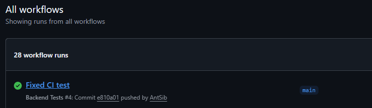
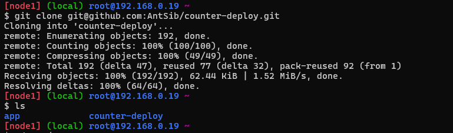
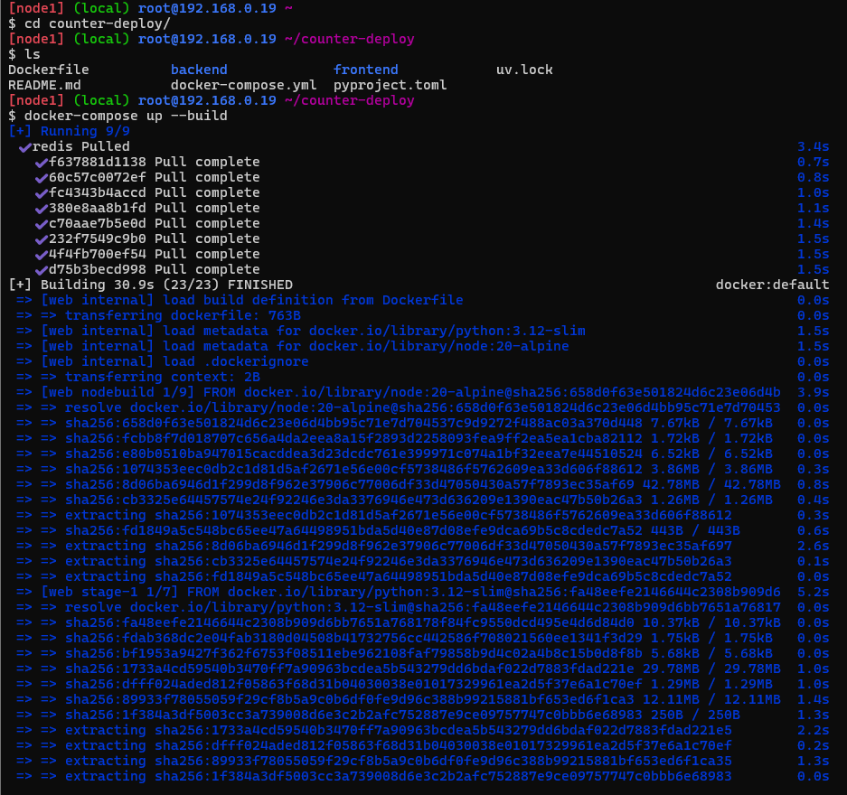
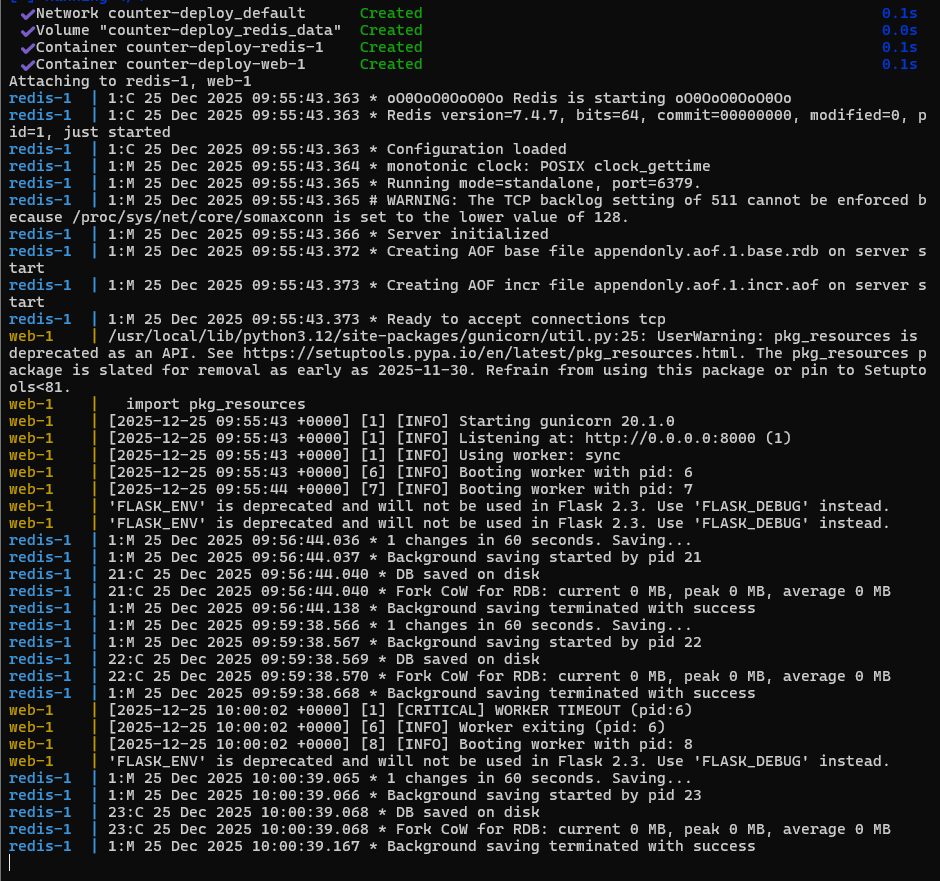
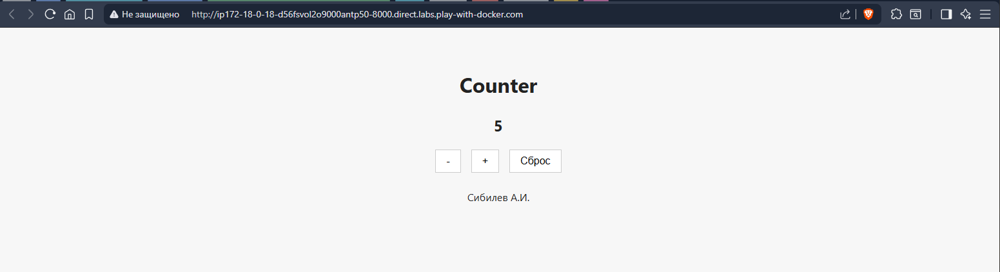

# Лабораторная работа №7. Деплой приложения на Flask с БД Redis

***Задание*** Развернуть / запустить приложение, представленное в репозитории локально и создать отчет о его развертывание.
Развернуть / запустить приложение на play with docker (https://labs.play-with-docker.com/).
Развернуть / запустить приложение удаленно на машине, предоставленной преподавателем с учетом сетевых настроек и каталога, куда будет публиковаться приложение.  Учесть, что на этот сервер будет произведен деплой приложения студентов группы, т.е. надо менять порты, папку для деплоя и другие настройки приложения, которые должны быть отличны для разных студентов (чтобы не мешать друг другу).
Реализовать тестирование серверной логики и деплой Flask-приложения с использованием CI.

### Структура проекта

```
counter_deploy/
├─ backend/
│  ├─ __init__.py
│  ├─ main.py
│  ├─ tests/
│  │  ├─ __init__.py
│  │  ├─ conftest.py
│  │  ├─ test_counter.py
│  │  └─ test_requirements.txt
│  ├─ .env.example
│  ├─ app.py
│  └─ requirements.txt
├─ frontend/
│  ├─ src/
│  │  ├─ api/
│  │  │  └─ counter.ts
│  │  ├─ App.tsx
│  │  ├─ index.css
│  │  └─ main.tsx
│  ├─ index.html
│  ├─ package.json
│  ├─ package-lock.json
│  ├─ tsconfig.json
│  └─ vite.config.ts
├─ .python-version
├─ Dockerfile
├─ docker-compose.yml
├─ README.md
├─ pyproject.toml
└─ uv.lock
```

### Описание программы

Была разработана программа, реализованная на основе веб-фреймворков React, Flask и базы данных Redis. Приложение предоставляет счётчик и возможности увеличения, уменьшения (не меньше нуля) и сброса.

Ссылка на репозиторий с проектом: [github.com/AntSib/counter-deploy](https://github.com/AntSib/counter-deploy)

### Тестирование программы

Тестирование осуществляется с помощью pytest при <code>push в </code>main</code>.
Тестируются:
* Увеличение счётчика;
* Уменьшение счётчика
* Корректный ответ при уменьшении счётчика меньше нуля;
* Сброс счётчика;
* Корректный ответ для некорректного раута.



### Развертывание приложения на play-with-docker

Подключение по ssh и клонирование репозитория:


Сборка контейнера:


Работающее приложение:


Веб интерфейс:

