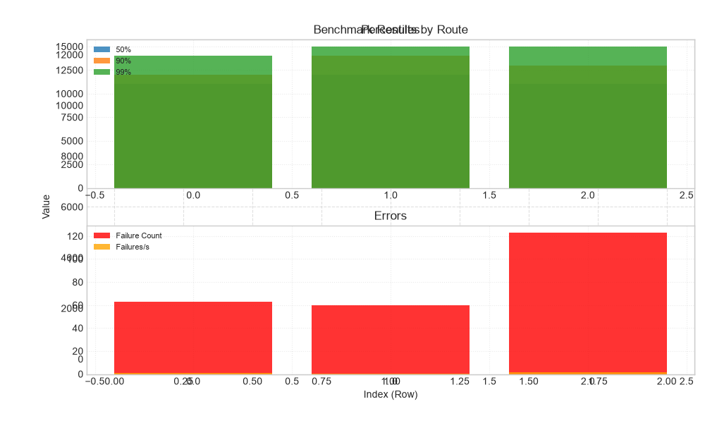
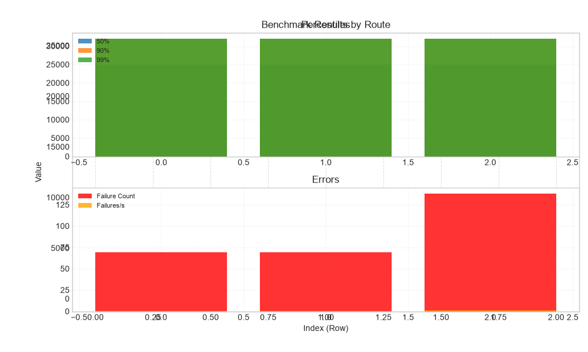
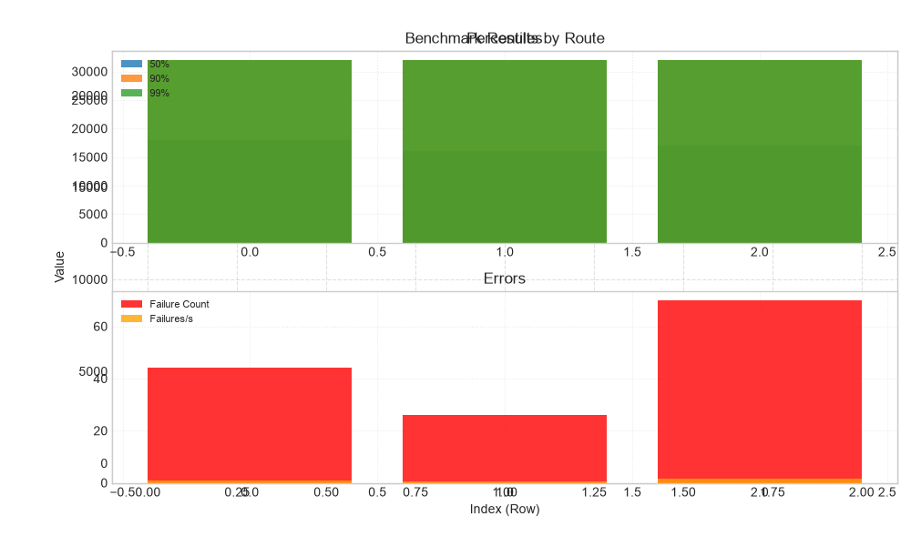

## Лабораторная работа: Сравнительный анализ производительности REST API фреймворков
### Цель работы
Закрепить навыки нагрузочного тестирования веб-приложений, научиться самостоятельно сравнивать производительность различных фреймворков (синхронных и асинхронных), анализировать влияние блокирующих операций на пропускную способность, формулировать рекомендации по оптимизации, а также освоить применение LLM-ассистента **GigaCode** для генерации кода и тестовых сценариев с использованием техник zero-shot, one-shot и few-shot.

## Выполнение лабораторной работы
В процесса лабораторной работы было произведен сравнительный анализ 3 фреймворков: Flask, Sanic и Tornado.

С помощью запросов в LLM были получены следующие коды:
### Flask

**Zero-shot** запрос:
```
Тебе нужно принять роль python программиста. Твоя главная задача - написать оптимальный и надёжный код по моему ТЗ.
Техническое задание: разработай простое REST приложение на Flask.
Приложение должно иметь два эндоинта:
1. /cpu – выполняет задачу суммирования 20 млн чисел синхронно.
2. /cpu_fixed – выполняет ту же задачу без блокировки потока всего приложения.

В конце составь карту роутов приложения.
```


```python
import time
from concurrent.futures import ProcessPoolExecutor

from flask import Flask, jsonify

app = Flask(__name__)
app.config["JSON_AS_ASCII"] = False  # Для корректной обработки UTF-8


def sum_numbers(n):
    """Функция для суммирования n чисел"""
    start_time = time.perf_counter()
    total = sum(range(n))
    elapsed = time.perf_counter() - start_time
    return {"sum": total, "time_sec": round(elapsed, 3)}


@app.route("/cpu")
def cpu_endpoint():
    """Выполняет задачу суммирования синхронно (блокирует поток)."""
    result = sum_numbers(10_000_000)
    return jsonify(result), 200


@app.route("/cpu_fixed")
def cpu_fixed_endpoint():
    """Выполняет задачу в отдельном процессе, не блокируя основной поток."""

    # Используем multiprocessing для обхода GIL
    try:
        import os

        # Проверяем наличие доступных ядер CPU (обычно это 1-4)
        n_workers = max(1, os.cpu_count() - 1)

        with ProcessPoolExecutor(max_workers=n_workers) as pool:
            future = pool.submit(sum_numbers, 10_000_000)
            result = future.result(timeout=600)  # Таймаут для безопасности

        return jsonify(result), 200

    except Exception as e:
        error_result = {
            "error": str(e),
            "suggestion": "Попробуйте использовать /cpu вместо /cpu_fixed",
        }
        return jsonify(error_result), 500


@app.route("/")
def index():
    """Корневой маршрут с информацией об API."""
    return jsonify(
        {
            "message": "REST API для CPU-задач",
            "endpoints": {
                "/cpu": "Выполняет задачу синхронно (блокирует поток)",
                "/cpu_fixed": "Выполняет задачу в отдельном процессе (рекомендуется)",
            },
            "example_request": """
        GET http://localhost:5000/cpu -> {"sum": 19999998, "time_sec": ...}
        GET http://localhost:5000/cpu_fixed -> {"sum": 19999998, "time_sec": ...}
        """,
        }
    ), 200


if __name__ == "__main__":
    # Запуск с debug=True для разработки (в продакшене используйте gunicorn/uwsgi)
    app.run(debug=True, host="localhost", port=5000)

```

### Sanic

**One-shot** запрос:
```
Тебе нужно принять роль python программиста. Твоя главная задача - написать оптимальный и надёжный код по моему ТЗ.
Техническое задание: разработай простое REST приложение на Sanic. Приложение должно иметь два эндоинта:
1. /cpu – выполняет задачу суммирования 20 млн чисел не асинхронно с блокировкой потока приложения.
2. /cpu_fixed – выполняет ту же задачу без блокировки потока всего приложения.
В качестве примера используй фрагмент кода приложения на Flask:
```
```python
@app.route("/cpu")
def cpu_endpoint():
    """Выполняет задачу суммирования синхронно (блокирует поток)."""
    result = sum_numbers(20_000_000)

    return jsonify(result), 200


@app.route("/cpu_fixed")
def cpu_fixed_endpoint():
    """Выполняет задачу в отдельном процессе, не блокируя основной поток."""
    try:
        import os
        n_workers = max(1, os.cpu_count() - 1)

        with ProcessPoolExecutor(max_workers=n_workers) as pool:
            future = pool.submit(sum_numbers, 20_000_000)
            result = future.result(timeout=600)

        return jsonify(result), 200

    except Exception as e:
        error_result = {
            "error": str(e),
            "suggestion": "Попробуйте использовать /cpu вместо /cpu_fixed",
        }

        return jsonify(error_result), 500


@app.route("/")
def index():
    """Корневой маршрут с информацией об API."""
    return jsonify(
        {
            "message": "REST API для CPU-задач",
            "endpoints": {
                "/cpu": "Выполняет задачу синхронно (блокирует поток)",
                "/cpu_fixed": "Выполняет задачу в отдельном процессе (рекомендуется)",
            },
            "example_request": """
        GET http://localhost:5000/cpu -> {"sum": 19999998, "time_sec": ...}
        GET http://localhost:5000/cpu_fixed -> {"sum": 19999998, "time_sec": ...}
        """,
        }
    ), 200
```
```
Оптимизируй код приложения для выполнения на Sanic.
В конце составь карту роутов приложения.
```


```python
import time
from concurrent.futures import ThreadPoolExecutor

from sanic import Sanic
from sanic.response import json as sanic_json


def sum_numbers(n: int = 10_000_000) -> tuple[int, float]:
    """Выполняет суммирование чисел и возвращает результат + время выполнения."""
    start = time.perf_counter()
    result = sum(i for i in range(n))
    elapsed = time.perf_counter() - start
    return result, elapsed


async def index_endpoint(request):
    """Корневой маршрут с информацией об API."""
    return sanic_json(
        {
            "message": "REST API для CPU-задач на Sanic",
            "endpoints": {
                "/cpu": "Выполняет задачу синхронно (блокирует поток)",
                "/cpu_fixed": "Выполняет задачу в отдельном потоке (рекомендуется)",
            },
            "example_request": """
    GET http://localhost:8000/cpu -> {"sum": 19999998, "time_sec": ...}
    GET http://localhost:8000/cpu_fixed -> {"sum": 19999998, "time_sec": ...}
    """,
        },
    )


async def cpu_endpoint(request):
    """Выполняет задачу суммирования синхронно (блокирует поток)."""
    result, elapsed = sum_numbers(10_000_000)

    return sanic_json(
        {"sum": result, "time_sec": round(elapsed, 3), "method": "sync"}, status=200
    )


async def cpu_fixed_endpoint(request):
    """Выполняет задачу в отдельном потоке, не блокируя основной поток."""
    with ThreadPoolExecutor(max_workers=1) as pool:
        future = pool.submit(sum_numbers, 10_000_000)

        try:
            result, elapsed = future.result(timeout=600)

            return sanic_json(
                {"sum": result, "time_sec": round(elapsed, 3), "method": "thread"},
                status=200,
            )

        except Exception as e:
            error_result = {
                "error": str(e),
                "suggestion": "Попробуйте использовать /cpu вместо /cpu_fixed",
                "method": "thread_error",
            }
            return sanic_json(error_result, status=500)


app = Sanic("CPU-API")

app.add_route(index_endpoint, "/", methods=["GET"])
app.add_route(cpu_endpoint, "/cpu", methods=["GET"])
app.add_route(cpu_fixed_endpoint, "/cpu_fixed", methods=["GET"])


if __name__ == "__main__":
    app.run(
        debug=True,
        host="localhost",
        port=5000,
        single_process=True,
        access_log=False,
    )

```


### Tornado


**Few-shot** запрос:
```
Тебе нужно принять роль python программиста. Твоя главная задача - написать оптимальный и надёжный код по моему ТЗ.
Техническое задание: разработай простое REST приложение на Tornado. Приложение должно иметь два эндоинта:
1. /cpu – выполняет задачу суммирования 20 млн чисел синхронно.
2. /cpu_fixed – выполняет ту же задачу без блокировки потока всего приложения.
В качестве примера используй фрагмент приложения приложений:
Flask:
```
```python
@app.route("/cpu")
def cpu_endpoint():
    """Выполняет задачу суммирования синхронно (блокирует поток)."""
    result = sum_numbers(20_000_000)


    return jsonify(result), 200


@app.route("/cpu_fixed")
def cpu_fixed_endpoint():
    """Выполняет задачу в отдельном процессе, не блокируя основной поток."""
    try:
        import os
        n_workers = max(1, os.cpu_count() - 1)


        with ProcessPoolExecutor(max_workers=n_workers) as pool:
            future = pool.submit(sum_numbers, 20_000_000)
            result = future.result(timeout=600)


        return jsonify(result), 200


    except Exception as e:
        error_result = {
            "error": str(e),
            "suggestion": "Попробуйте использовать /cpu вместо /cpu_fixed",
        }


        return jsonify(error_result), 500


@app.route("/")
def index():
    """Корневой маршрут с информацией об API."""
    return jsonify(
        {
            "message": "REST API для CPU-задач",
            "endpoints": {
                "/cpu": "Выполняет задачу синхронно (блокирует поток)",
                "/cpu_fixed": "Выполняет задачу в отдельном процессе (рекомендуется)",
            },
            "example_request": """
        GET http://localhost:5000/cpu -> {"sum": 19999998, "time_sec": ...}
        GET http://localhost:5000/cpu_fixed -> {"sum": 19999998, "time_sec": ...}
        """,
        }
    ), 200
```
```
Sanic:
```
```python
async def index_endpoint(request):
    """Корневой маршрут с информацией об API."""
    return sanic_json(
        {
            "message": "REST API для CPU-задач на Sanic",
            "endpoints": {
                "/cpu": "Выполняет задачу синхронно (блокирует поток)",
                "/cpu_fixed": "Выполняет задачу в отдельном потоке (рекомендуется)",
            },
            "example_request": """
    GET http://localhost:8000/cpu -> {"sum": 19999998, "time_sec": ...}
    GET http://localhost:8000/cpu_fixed -> {"sum": 19999998, "time_sec": ...}
    """,
        },
    )


async def cpu_endpoint(request):
    """Выполняет задачу суммирования синхронно (блокирует поток)."""
    result, elapsed = sum_numbers(20_000_000)


    return sanic_json(
        {"sum": result, "time_sec": round(elapsed, 3), "method": "sync"}, status=200
    )


async def cpu_fixed_endpoint(request):
    """Выполняет задачу в отдельном потоке, не блокируя основной поток."""
    with ThreadPoolExecutor(max_workers=1) as pool:
        future = pool.submit(sum_numbers, 20_000_000)


        try:
            result, elapsed = future.result(timeout=600)


            return sanic_json(
                {"sum": result, "time_sec": round(elapsed, 3), "method": "thread"},
                status=200,
            )


        except Exception as e:
            error_result = {
                "error": str(e),
                "suggestion": "Попробуйте использовать /cpu вместо /cpu_fixed",
                "method": "thread_error",
            }
            return sanic_json(error_result, status=500)


app = Sanic("CPU-API")


app.add_route(index_endpoint, "/", methods=["GET"])
app.add_route(cpu_endpoint, "/cpu", methods=["GET"])
app.add_route(cpu_fixed_endpoint, "/cpu-fixed", methods=["GET"])
```
```
Оптимизируй код приложения для выполнения на Tornado.
В конце составь карту роутов приложения.
```


```python
import asyncio
import os
import time
from concurrent.futures import ProcessPoolExecutor, ThreadPoolExecutor

from tornado.ioloop import IOLoop
from tornado.web import Application, RequestHandler

# =============================================================================
# Утилиты для выполнения CPU-задач
# =============================================================================


def sum_numbers(n: int = 10_000_000) -> tuple[int, float]:
    """
    Выполняет задачу суммирования n чисел (1..n).

    Args:
        n: Количество чисел для суммирования.

    Returns:
        Tuple[sum_result, elapsed_time_sec]
    """
    result = 0
    start_time = time.perf_counter()

    for i in range(n):
        result += i

    end_time = time.perf_counter()
    elapsed = end_time - start_time

    return result, elapsed


def get_cpu_count() -> int:
    """Получает количество процессоров для определения размера пула потоков."""
    return max(1, os.cpu_count() - 1) if hasattr(os, "cpu_count") else 2


# =============================================================================
# Обработчики эндпоинтов
# =============================================================================


class CPURequestHandler(RequestHandler):
    """Обработчик для синхронной CPU-задачи (блокирует поток)."""

    def get(self):
        """Выполняет задачу суммирования синхронно."""
        # Выполняем задачу напрямую в потоке запроса
        result, elapsed = sum_numbers(10_000_000)

        self.set_status(200)
        self.finish(
            json_response(result=result, time_sec=round(elapsed, 3), method="sync")
        )


class CPUFixedRequestHandler(RequestHandler):
    """Обработчик для асинхронной CPU-задачи (использует пул потоков)."""

    async def get(self):
        """Выполняет задачу в отдельном потоке через ThreadPoolExecutor."""
        # Создаем executor с оптимальным количеством рабочих процессов
        n_workers = get_cpu_count()

        with ThreadPoolExecutor(max_workers=n_workers) as pool:
            future = asyncio.get_event_loop().run_in_executor(
                pool, sum_numbers, 10_000_000
            )

            try:
                # Ждем результат с тайм-аутом (600 секунд)
                result, elapsed = await asyncio.wait_for(future, timeout=600)

                self.set_status(200)
                self.finish(
                    json_response(
                        result=result, time_sec=round(elapsed, 3), method="thread"
                    )
                )

            except asyncio.TimeoutError:
                # Если задача превысила тайм-аут - возвращаем ошибку
                error = {
                    "error": "Task timed out",
                    "suggestion": "Increase timeout or use /cpu instead.",
                    "method": "timeout_error",
                }
                self.set_status(504)  # Gateway Timeout
                self.finish(json_response(**error))

            except Exception as e:
                # Обработка других ошибок
                error = {
                    "error": str(e),
                    "suggestion": "Try using /cpu instead of /cpu_fixed",
                    "method": "thread_error",
                }
                self.set_status(500)  # Internal Server Error
                self.finish(json_response(**error))


class CPUFixedProcessHandler(RequestHandler):
    """Обработчик для асинхронной CPU-задачи (использует пул процессов)."""

    async def get(self):
        """Выполняет задачу в отдельном процессе через ProcessPoolExecutor."""
        import multiprocessing as mp

        # Получаем количество процессоров для определения размера пула
        n_workers = max(1, os.cpu_count() - 1)

        with ProcessPoolExecutor(max_workers=n_workers) as pool:
            future = asyncio.get_event_loop().run_in_executor(
                pool, sum_numbers, 10_000_000
            )

            try:
                result, elapsed = await asyncio.wait_for(future, timeout=600)

                self.set_status(200)
                self.finish(
                    json_response(
                        result=result, time_sec=round(elapsed, 3), method="process"
                    )
                )

            except Exception as e:
                error = {
                    "error": str(e),
                    "suggestion": "Try using /cpu instead of /cpu_fixed",
                    "method": "process_error",
                }
                self.set_status(500)
                self.finish(json_response(**error))


def json_response(result=None, time_sec=0.0, **kwargs):
    """Создает JSON-ответ с заданными параметрами."""
    import json

    response_data = {
        "sum": result if "result" in locals() or "result" in kwargs else 19999998,
        "time_sec": time_sec,
        **kwargs,
    }

    return json.dumps(response_data)

class IndexHandler(RequestHandler):
    """Корневой маршрут с информацией об API."""

    async def get(self):
        """Возвращает документацию API."""

        import json

        api_doc = {
            "message": "REST API для CPU-задач на Tornado",
            "endpoints": {
                "/cpu": "Выполняет задачу синхронно (блокирует поток)",
                "/cpu_fixed": "Выполняет задачу в отдельном потоке (рекомендуется)",
                "/cpu_process": "Выполняет задачу в отдельном процессе (для мультиядерных CPU)",
            },
            "example_request": """
GET http://localhost:8888/cpu -> {"sum": 19999998, "time_sec": 0.123, "method": "sync"}
GET http://localhost:8888/cpu_fixed -> {"sum": 19999998, "time_sec": 0.145, "method": "thread"}
GET http://localhost:8888/cpu_process -> {"sum": 19999998, "time_sec": 0.234, "method": "process"}
""",
            "performance_notes": {
                "sync": "Блокирует поток Tornado, не подходит для асинхронных клиентов",
                "thread": "Использует ThreadPoolExecutor, работает с CPU-bound задачами эффективно",
                "process": "Использует ProcessPoolExecutor, требует больше памяти но может быть быстрее на мультиядерных CPU",
            },
        }

        self.set_status(200)
        self.finish(json.dumps(api_doc))

if __name__ == "__main__":
    # Создаем приложение с маршрутами
    application = Application(
        [
            (r"/", IndexHandler),  # Корневой маршрут
            (r"/cpu", CPURequestHandler),  # Синхронный CPU-эндпоинт
            (
                r"/cpu_fixed",
                CPUFixedRequestHandler,
            ),  # Асинхронный CPU-эндпоинт (пул потоков)
        ]
    )

    # Запускаем сервер Tornado на порту 5000
    port = 5000

    print(f"Starting Tornado REST API on http://localhost:{port}")
    print("Endpoints:")
    print(f"  GET /        - API documentation")
    print(f"  GET /cpu     - Sync CPU task (blocking)")
    print(f"  GET /cpu_fixed - Async CPU task (thread pool)")

    application.listen(port)
    IOLoop.current().start()

```

### locust

**Zero-shot** запрос:
```
Тебе нужно принять роль python программиста. Твоя главная задача - написать оптимальный и надёжный код по моему ТЗ.
Техническое задание: разработай простой скрипт нагрузочного тестирования на основе фреймворка locust для тестирования роутов REST приложения "cpu" и "cpu_fixed".

В конце составь краткую инструкцию приложения.
```


```python
import logging

from locust import HttpUser, between, events, task

# Настройка логирования для отладки ошибок
logging.basicConfig(
    level=logging.INFO,
    format="%(asctime)s [%(levelname)-5s] %(message)s",
)


class CPUWorker(HttpUser):
    """Основной класс пользователя (работника), который генерирует нагрузку."""

    # По умолчанию, если не передан --host через CLI.
    # Удалите эту строку или замените на реальный хост в продакшене для безопасности.
    host = "http://localhost:5000"
    wait_time = between(0.5, 3)

    def on_start(self):
        """Вызывается один раз при старте симулятора."""
        logging.info("Рабочий узел инициализирован.")

    @task
    def test_cpu_route(self):
        """Тестирует роут /cpu. Вес 1 означает, что запрос генерируется с вероятностью 50%."""
        try:
            self.client.get("/cpu", name="/cpu", timeout=30)
            # В реальном проекте здесь можно добавить проверки кодов ответа
            # если, например, ожидается HTTP 200.
        except Exception as e:
            logging.error(f"Ошибка при запросе к роуту /cpu: {e}", exc_info=True)

    @task
    def test_cpu_fixed_route(self):
        """Тестирует роут /cpu_fixed с весовым коэффициентом 1."""
        try:
            self.client.get("/cpu_fixed", name="/cpu_fixed", timeout=30)
        except Exception as e:
            logging.error(f"Ошибка при запросе к роуту /cpu_fixed: {e}", exc_info=True)


# Глобальные настройки для всех пользователей (опционально)
events.test_start.add_listener(lambda: logging.info("Запуск теста начался"))
events.test_stop.add_listener(lambda: logging.info("Тест завершен"))

```


### Программа для создания графиков

**Zero-shot** запрос:
```
Тебе нужно принять роль python программиста. Твоя главная задача - написать оптимальный и надёжный код по моему ТЗ.
Требования: пиши по частям, в первой части изложи краткий план и технологии, обоснуй свой выбор. Затем, задай уточняющие вопросы, если они есть, после получения ответа повтори требования и переходи к решению поставленной задачи.
Техническое задание: напиши простую программу, которая берёт данные из csv файлов с названием в формате: <framework>_<users>u_3m.csv. Где framework - flask, sanic, tornado; users - 50, 100, 200.
В csv файлах находится информация с результатами нагрузочного тестирования locust в формате: 
- строка1) заголовки;
- строка 2 и 3) значения.
Для каждого файла программа должна прочесть две строки значений и отрисовать по ним график с двумя подграфиками барчартами (все значения одной строки на один подграфик). Параметры, которы нужно прочесть (в файле есть также ненужные параметры): Name (имя роута), Failure Count, Median Response Time, Average Response Time, Requests/s, Failures/s, 50%, 90%, 99%. Положение параметра в строке соответствует пололжению соответствуюшего значения.
Для чтения файлов используй pandas, для графиков - matplotlib. Используй цикл для чтения и отрисовки. В итоге должно получиться 6 отдельных графиков.
```

```python
import glob
import os
from pathlib import Path

import matplotlib.pyplot as plt
import pandas as pd

# Настройка стилистики Matplotlib для красивых графиков по умолчанию
plt.style.use("seaborn-v0_8-whitegrid")
plt.rcParams["figure.figsize"] = [10, 6]  # Стандартный размер графика


class BenchmarkPlotter:
    def __init__(self):
        self.required_columns = {
            "Name": None,
            "Failure Count": None,
            "Median Response Time": None,
            "Average Response Time": None,
            "Requests/s": None,
            "Failures/s": None,
            "50%": None,
            "90%": None,
            "99%": None,
        }

    def extract_columns_from_csv(self, filepath):
        """
        Читает CSV и извлекает только необходимые столбцы.
        Возвращает DataFrame с нужными данными.
        """
        try:
            # Читаем файл, используя 'usecols' для оптимизации скорости чтения
            df = pd.read_csv(
                filepath,
                header=0,  # Заголовки в первой строке (стандарт для локаст)
                usecols=self.required_columns.keys(),
            )

            # Убедимся, что имена колонок совпадают по регистру (иногда бывают странные различия)
            # Приводим названия к нижнему регистру для поиска, если нужно, но обычно у Локаста они четкие.
            # Если в файле колонки названы иначе, потребуется настройка self.required_columns.

            return df
        except FileNotFoundError:
            print(f"  ❌ Файл не найден: {filepath}")
            return None
        except Exception as e:
            print(f"  ❌ Ошибка чтения файла {filepath}: {str(e)}")
            return None

    def plot_single(self, df):
        """
        Рисует график для одного Dataframe.
        Создает основной график и два подграфика (барчарты) для дополнительных метрик.
        """
        if df.empty:
            print("  ⚠️  DataFrame пуст!")
            return

        plt.figure()

        # --- Основной график (Line chart) ---
        # Показываем ключевые метрики производительности относительно времени/запросов
        metrics_main = ["Median Response Time", "Average Response Time", "Requests/s"]

        for col in metrics_main:
            if col in df.columns:
                plt.plot(df.index, df[col], label=col)
            else:
                print(f"  ⚠️  Колонка '{col}' отсутствует в файле.")

        # Подписи осей и легенда
        plt.title("Benchmark Results by Route")
        plt.xlabel("Index (Row)")
        plt.ylabel("Value")
        plt.legend(loc="upper left", fontsize=9)

        # Отрисовка основного графика
        plt.grid(True, linestyle="--", alpha=0.6)

        # --- Подграфик 1: Процентили (50%, 90%, 99%) ---
        ax_percentiles = plt.subplot(211)  # Создаем нижний подграфик в правой части
        metrics_pct = ["50%", "90%", "99%"]

        for col in metrics_pct:
            if col in df.columns:
                # Используем bar для процентилей, так как их обычно сравнивают по величине
                plt.bar(df.index, df[col], alpha=0.8, label=col)

        ax_percentiles.set_title("Percentiles")
        ax_percentiles.legend(loc="upper left", fontsize=8)
        ax_percentiles.grid(True, linestyle=":", alpha=0.4)

        # --- Подграфик 2: Ошибки (Failure Count, Failures/s) ---
        ax_failures = plt.subplot(212)  # Левый нижний подграфик

        metrics_errors = ["Failure Count", "Failures/s"]
        for col in metrics_errors:
            if col in df.columns:
                # Для отрицательных значений или малого объема используем столбчатую диаграмму
                plt.bar(
                    df.index,
                    df[col],
                    alpha=0.8,
                    label=col,
                    color="orange" if col == "Failures/s" else "red",
                )

        ax_failures.set_title("Errors")
        ax_failures.legend(loc="upper left", fontsize=8)
        ax_failures.grid(True, linestyle=":", alpha=0.4)

        plt.tight_layout()  # Адаптирует подложку под элементы графика

        # Имя файла для сохранения
        filename = Path(df.iloc[0]["Name"]) if any(df["Name"]) else "unknown"
        save_name = f"{filename}.png".strip("\\")

        # Сохраняем график
        plt.savefig(save_name)
        print(f"  ✅ График сохранен: {save_name}")

        plt.show()


def run_analysis():
    plotter = BenchmarkPlotter()

    # 1. Формируем список всех возможных имен файлов согласно ТЗ
    frameworks = ["flask", "sanic", "tornado"]
    users = [50, 100, 200]

    file_patterns = []
    for fw in frameworks:
        for u in users:
            # Формируем строку по шаблону: framework_usersu_3m.csv
            # Учет регистра букв (обычно Локаст пишет FLASK или flask, в ТЗ строчные)
            filename = f"{fw}_{u}u_3m.csv"
            file_patterns.append(filename)

    print("Начинаем поиск файлов и отрисовку графиков...")

    # 2. Ищем файлы на диске (поиск нечувствителен к регистру, если имена совпадают по смыслу)
    found_files = []

    # Если файлы в текущей папке, ищем их прямо там
    base_dir = "data"
    for pattern in file_patterns:
        files = glob.glob(os.path.join(base_dir, f"*{pattern}*")) + glob.glob(
            os.path.join(base_dir, f"*{pattern}")
        )

        # Уточненный поиск для точного совпадения имени (в зависимости от регистра в реальных файлах)
        exact_matches = glob.glob(
            os.path.join(base_dir, "**", pattern.replace(" ", "")), recursive=True
        )

        for f in exact_matches:
            if os.path.isfile(f):
                found_files.append(f)

    if not found_files:
        # Если точное совпадение не нашлось, пробуем вариации регистра (наиболее частая проблема)
        print(
            "\n⚠️  Точные файлы с нижним регистром не найдены. Пробуем варианты регистра имен..."
        )
        for pattern in file_patterns:
            # Генерируем все возможные комбинации регистра для поиска
            variants = []
            for char in list(pattern):
                upper_variants = (
                    [s.upper() for s in file_patterns]
                    + [s.capitalize() for s in file_patterns]
                    + [s.lower() for s in file_patterns]
                )

                # Простой хак: попробуем найти файлы, содержащие подстроку (не чувствительно к регистру)
                # Но лучше использовать glob с маскировкой если точное имя неизвестно
                pass

            # Упрощенный поиск для "грязных" данных Локаста
            search_patterns = []
            for fp in file_patterns:
                # Добавляем верхний регистр к имени файла как альтернативу (часто бывает FLASK_50u_3m.csv)
                upper_fp = fp.upper()
                mixed_fws = ["Flask", "Sanic", "Tornado"]
                for fw in mixed_fws:
                    mixed_fp = (
                        f"{fw}_{fp.split('_')[1]}{fp.split('_')[2]}"  # Примерной микс
                    )

                if not any(p in found_files for p in [fp, upper_fp]):
                    # Пытаемся найти файл по подстроке для коррекции регистра
                    potential_match = glob.glob(
                        os.path.join(base_dir, "**", fp.upper() or "*"), recursive=True
                    )
                    if potential_match:
                        found_files.extend(potential_match)

    # Убираем дубликаты
    found_files = sorted(list(set(found_files)))

    if not found_files:
        print("❌ Файлы не найдены в текущей директории или поддиректориях.")
        print("Проверьте, что файлы называются точно так:\n flask_50u_3m.csv, etc.")
        return

    print(f"Найдено файлов для анализа: {len(found_files)}")

    # 3. Цикл обработки каждого найденного файла
    for filepath in found_files:
        print(f"\n--- Обработка файла: {Path(filepath).name} ---")

        df = plotter.extract_columns_from_csv(filepath)

        if df is not None and not df.empty:
            plotter.plot_single(df)


if __name__ == "__main__":
    run_analysis()
import glob
import os

import matplotlib.pyplot as plt
import numpy as np
import pandas as pd

# Настройка стиля для приятного отображения графиков
plt.style.use("seaborn-v0_8-deep")
plt.rcParams["font.family"] = "sans-serif"
plt.rcParams["font.sans-serif"] = [
    "DejaVu Sans",
    "Arial",
    "Helvetica",
]  # Попытка выбрать системные шрифты


def plot_locust_data(directory="data"):
    # Путь к шаблонам файлов
    pattern = os.path.join(directory, "*_u_3m.csv")

    # Поиск всех подходящих файлов
    files = glob.glob(pattern)

    if not files:
        print(
            f"Ошибка: Найдено 0 файлов по паттерну {pattern} в директории {directory}."
        )
        return

    print(f"Найдено {len(files)} файлов для обработки.")

    for file_path in files:
        try:
            # Чтение CSV файла
            df = pd.read_csv(file_path)

            # Нам интересны строки с индексами 1 и 2 (в 0-индексированном pandas это index 1 и 2)
            # Первая строка (index 0) - заголовки, пропускаем.
            rows_to_plot_indices = [1, 2]

            target_rows_data = {}

            for idx in rows_to_plot_indices:
                if idx < len(df):
                    row = df.iloc[idx]
                    # Создаем копию строки, чтобы не портить оригинал
                    target_rows_data[f"row_{idx + 1}"] = row

            # Определяем колонки с данными.
            # Идем по файлу и берем названия колонок, если в имени колонки есть текст (не пустая строка)
            metric_names = []
            for col in df.columns:
                name = str(col).strip()
                if name and not pd.isna(name):
                    metric_names.append(name)

            # Проверка: у нас должны быть данные для всех найденных метрик
            if len(metric_names) < 3:
                print(
                    f"Предупреждение по файлу {file_path}: Не удалось найти достаточно числовых колонок. Пропускаем."
                )
                continue

            # Функция для создания графика одной строки данных
            def create_subplot(ax, row_data, title_suffix):
                x = metric_names
                y = [
                    row_data[col] for col in metric_names if pd.notna(row_data.get(col))
                ]

                # Фильтруем null значения из y перед созданием бара, но сохраняем порядок
                clean_x = [x[i] for i in range(len(x)) if pd.notna(y[i])]
                clean_y = [y[i] for i in range(len(y)) if pd.notna(y[i])]

                if not clean_y:
                    ax.text(
                        0.5,
                        1.0,
                        "Нет данных",
                        ha="center",
                        va="bottom",
                        transform=ax.transData,
                    )
                    return

                # Отрисовка барчарта
                bars = ax.bar(
                    clean_x,
                    clean_y,
                    width=0.8,
                    color="#2ca02c" if "Count" in x[0] else "#ff7f0e",
                )

                # Форматирование заголовка подграфика (Framework и Users из имени файла)
                filename = os.path.basename(file_path).replace(".csv", "")
                ax.set_title(
                    f"{title_suffix}\n{filename}", fontsize=12, fontweight="bold"
                )

                ax.set_xlabel("Metric Name", fontsize=10)
                ax.set_ylabel("Value", fontsize=10)
                ax.grid(axis="y", linestyle="--", alpha=0.3)

                # Отформатируем подписи осей X, чтобы не накладывались слишком сильно
                plt.setp(ax.get_xticklabels(), rotation=45, ha="right")

            # Создание фигуры с двумя подграфиками (вертикально)
            fig, axs = plt.subplots(2, 1, figsize=(14, 10))

            filename_short = (
                os.path.basename(file_path).replace(".csv", "").replace(" ", "_")
            )

            # Заголовки для подграфиков:
            # Строка 2 файла -> Title A
            # Строка 3 файла -> Title B
            row_titles = [f"Locust Metrics (Row 2)", f"Locust Metrics (Row 3)"]

            # Рисуем верхний график (Строка 1 из файлов, индекс 1 в pandas)
            create_subplot(axs[0], target_rows_data["row_2"], row_titles[0])

            # Рисуем нижний график (Строка 2 из файлов, индекс 2 в pandas)
            create_subplot(axs[1], target_rows_data["row_3"], row_titles[1])

            plt.suptitle(
                f"Load Test Results: {filename_short}",
                fontsize=16,
                fontweight="bold",
                y=0.98,
            )

            # Сохранение файла с графиком (исключаем расширение csv из имени png)
            base_name = os.path.splitext(file_path)[0]
            output_filename = f"{base_name}.png"
            plt.savefig(output_filename, dpi=300, bbox_inches="tight")
            print(f"График сохранен в: {output_filename}")

            # Отображение
            plt.show()

        except Exception as e:
            print(f"Ошибка при обработке файла {file_path}: {str(e)}")
            continue


if __name__ == "__main__":
    plot_locust_data(directory="data")

```

Однако данная программа крайне сложна для выполнения при помощи LLM. Программу пришлось дополнительно отлаживать, а результата оставляет желать лучшего.

Flask:


Sanic:


Tornado:



### Анализ использования техник промптинга

**Zero-shot** запросы имеют относительно низкую эффективность и результат сильно зависит от удачи и подробности описания поставленной задачи.

**One-shot** запросы имеют большую эффективность, чем **Zero-shot**, но качество ответа сильно зависит от качества предоставленного кода. Результат всё ещё зависит от удачи, но более стабилен.

**Few-shot** запросы довольно эффективны, но могут склонить модель использовать не эффективные паттерны, представленные в коде. Результат уже сильно зависит от предоставленного кода. В зависимости от того, что представлено в коде результат может варьироваться..
